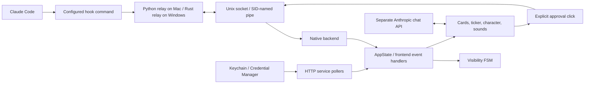
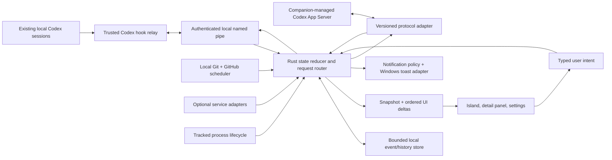

# Coucou → Windows Codex companion: repository analysis and implementation plan

Analysis date: 30 September 2026. Coucou snapshot: `3cc3333203f60f63326ee949b7b86c7549992a1f` on `main`. This document is a static source audit and a proposed design, not an implementation or a runtime certification.

The recommended starting point is Coucou's **existing Windows port**, using Tauri 2, Rust, TypeScript, and Canvas. Preserve its compact interaction model, tray lifecycle, nonactivating overlay, file-drop choreography, integration cards, and restrained sounds. Replace its Claude-specific event and chat adapters with a capability-aware Codex integration. Move authoritative state into the backend, introduce real session identities, and make GitHub track the coding workflow rather than only account statistics.

The central integration decision is to provide two explicit modes: **monitor existing Codex sessions through supported hooks**, and **manage companion-owned Codex sessions through App Server**. An independently launched App Server must not be presented as an automatic subscription to all Codex desktop chats.

## Audit scope and evidence

The audit inventoried all **215 tracked files**: both application implementations; hook relays; every UI, animation, state, settings, file, and integration module; build and release configuration; tests; design prototypes; screenshots and media inventories; website/legal/support pages; licenses; and dependency manifests and lockfiles. Executable behavior was traced through handlers and call sites, including whether visible controls actually invoke work. Binary assets were inventoried and representative screenshots inspected; asset files are not executable feature definitions. Lockfiles and generated Xcode metadata were inspected as dependency/build inputs rather than interpreted as product features. The [source inventory](coucou-source-inventory.md) accounts for every tracked path.

No application was built or launched, no authenticated third-party service was contacted, and no Codex configuration or hook trust was changed. The locally installed `codex-cli 0.157.1` was inspected through help and generated protocol types; schema generation did not start a session. Runtime compatibility with specific desktop releases remains a Phase 0 acceptance gate.

Evidence labels below:

- **M**: implemented in the macOS source.
- **W**: implemented in the Windows source.
- **Partial**: a renderer, schema, or control exists but the end-to-end action is incomplete.
- **Design**: prototype, specification, or marketing behavior without a corresponding current implementation.
- **Keep**: preserve the interaction or semantics with original branding/assets.
- **Adapt**: preserve its purpose but replace the implementation or meaning for Codex/Windows.
- **New**: necessary Codex companion functionality beyond Coucou.

Primary Coucou source groups, pinned to the audited commit:

| Reference | Source and purpose |
|---|---|
| S1 | [macOS application sources](https://github.com/louis-cfm/coucou/tree/3cc3333203f60f63326ee949b7b86c7549992a1f/NotchBuddy/Sources/App): native lifecycle, panel, state machine, views, character, services. |
| S2 | [Windows frontend](https://github.com/louis-cfm/coucou/tree/3cc3333203f60f63326ee949b7b86c7549992a1f/windows/src): island orchestration, view registry, animations, chat, settings. |
| S3 | [Windows backend](https://github.com/louis-cfm/coucou/tree/3cc3333203f60f63326ee949b7b86c7549992a1f/windows/src-tauri/src): IPC, integrations, credentials, files, native window behavior. |
| S4 | [Windows relay](https://github.com/louis-cfm/coucou/tree/3cc3333203f60f63326ee949b7b86c7549992a1f/windows/hook): event sanitation, pipe connection, permission response, tests. |
| S5 | [macOS view contents](https://github.com/louis-cfm/coucou/blob/3cc3333203f60f63326ee949b7b86c7549992a1f/NotchBuddy/Sources/App/IslandViewContent.swift): actual actions and several unfinished controls. |
| S6 | [Windows view contents](https://github.com/louis-cfm/coucou/blob/3cc3333203f60f63326ee949b7b86c7549992a1f/windows/src/views/views.ts): actual Windows actions and placeholders. |
| S7 | [Windows integration implementation](https://github.com/louis-cfm/coucou/blob/3cc3333203f60f63326ee949b7b86c7549992a1f/windows/src-tauri/src/integrations.rs) and [cards](https://github.com/louis-cfm/coucou/blob/3cc3333203f60f63326ee949b7b86c7549992a1f/windows/src/views/integrations.ts). |
| S8 | [macOS hook server](https://github.com/louis-cfm/coucou/blob/3cc3333203f60f63326ee949b7b86c7549992a1f/NotchBuddy/Sources/App/HookServer.swift), [Windows pipe server](https://github.com/louis-cfm/coucou/blob/3cc3333203f60f63326ee949b7b86c7549992a1f/windows/src-tauri/src/pipe.rs), and [Windows hook installer](https://github.com/louis-cfm/coucou/blob/3cc3333203f60f63326ee949b7b86c7549992a1f/windows/src-tauri/src/hooks.rs). |
| S9 | [Specification](https://github.com/louis-cfm/coucou/blob/3cc3333203f60f63326ee949b7b86c7549992a1f/docs/SPEC.md), [integration design](https://github.com/louis-cfm/coucou/blob/3cc3333203f60f63326ee949b7b86c7549992a1f/docs/INTEGRATIONS.md), and [original prototype](https://github.com/louis-cfm/coucou/blob/3cc3333203f60f63326ee949b7b86c7549992a1f/design/prototype/notch-buddy.html). These are design evidence, not proof of shipped behavior. |
| S10 | [Windows README](https://github.com/louis-cfm/coucou/blob/3cc3333203f60f63326ee949b7b86c7549992a1f/windows/README.md), [workflows](https://github.com/louis-cfm/coucou/tree/3cc3333203f60f63326ee949b7b86c7549992a1f/.github/workflows), and [macOS release script](https://github.com/louis-cfm/coucou/blob/3cc3333203f60f63326ee949b7b86c7549992a1f/scripts/release.sh). |
| S11 | [MIT source license](https://github.com/louis-cfm/coucou/blob/3cc3333203f60f63326ee949b7b86c7549992a1f/LICENSE) and [asset restrictions](https://github.com/louis-cfm/coucou/blob/3cc3333203f60f63326ee949b7b86c7549992a1f/LICENSE-ASSETS.md). |

## Complete feature and interaction catalog

### Island, window, navigation, and lifecycle

Sources: S1 `AppDelegate`, `IslandWindowController`, `IslandStateMachine`, `IslandRootView`; S2 `island/island.ts`, `island/fsm.ts`, `core/layout.ts`; S3 `island.rs`, `tray.rs`, `lib.rs`.

| ID | Feature | Actual behavior | Codex adaptation |
|---|---|---|---|
| F01 | Resident companion | M runs as a menu-bar accessory; W runs with a notification-area icon, no console or taskbar window. | Keep. |
| F02 | Top island placement | M uses measured notch geometry when available, with a fallback on displays without a notch. W sits at the top center of a display. | Keep W positioning; no physical notch assumption. |
| F03 | Display selection | W offers main display or display under cursor and adjusts to display/DPI changes. M follows its native screen/notch geometry. | Keep; add a stable selected-monitor option. |
| F04 | Transparent, borderless, topmost surface | Black island is drawn within a transparent panel with no ordinary title bar. M joins Spaces/full-screen behavior; W uses always-on-top/tool-window styles. | Keep; validate Windows full-screen coexistence. |
| F05 | Nonactivation and click-through | Overlay normally avoids stealing keyboard focus; pointer outside the island passes to the underlying app. W changes native activation for chat. | Keep; shape-aware hit testing and accessible focus on request. |
| F06 | Hidden wake area | M hides into the notch; W shrinks to a 240×6 transparent top-edge wake strip after closing animation. Hover reveals compact mode. | Keep configurable wake strip; offer hotkey-only hiding. |
| F07 | Four-state visibility FSM | Actual states are hidden, compact (`petit`), expanded (`home`), and greeting (`coucou`). | Keep, with attention pinning and explicit transition reasons. |
| F08 | Compact click | Clicking compact expands the overview. Current source does not implement the spec's hover-to-expanded delay. | Keep click default; hover expansion only as an optional new setting. |
| F09 | Auto-collapse | Expanded view collapses about 15 seconds after pointer leaves, configurable. Compact hides after 60 seconds. Entry cancels timers. | Keep; suspend while typing, dragging, or actionable requests are pending. |
| F10 | Collapse countdown | A thin bottom bar appears during the last `min(10s, 0.6 × auto-close)` interval, shrinking from 160 pixels. | Keep with reduced-motion/static option. |
| F11 | Launch greeting | Separate canvas sequence grows, squints, dips, pops hands, waves, adds badge/tint, and returns toward compact. Main sequence ends around 4.6 seconds. Hover extends greeting; leaving interrupts it. | Keep the greeting concept with an original character and choreography; allow disabling. |
| F12 | Spring geometry | Width, height, corners, character position/scale, and content animate with springs/easing; content fades and scales in after expansion. | Keep motion language, tune to measured Windows rendering. |
| F13 | Island silhouette | Black surface has top concave ears and rounded bottom corners; compact W is 288×32, most expanded W views 640×160. | Keep generic island form, use responsive logical dimensions. |
| F14 | View-specific geometry | Drop/choose are taller; greeting is 150 high; mail 240; chat grows from 240 toward 300 based on message count. W uses a 720×320 backing panel. | Adapt: bounded island plus larger detail panel for long outputs/diffs. |
| F15 | Header navigation | Home, Ask, Drop; right-side gear and sound toggle; selected tab styling. Header disappears for the dizzy/confused view. | Keep; Ask must show the target chat and capability. |
| F16 | Overview composition | Focused character and service/session card at left; up to four other colored pills at right. Compact shows other characters in a 2×2 mini-grid. | Adapt: separate session pills and integration pins with overflow. |
| F17 | Focus and badges | Selecting a pill changes main character/card and clears that pill's attention badge. Pills have tint, border, hover glow, and status icon. | Keep; preserve unresolved requests separately from acknowledgement. |
| F18 | Permanent coding pill | VS Code pill cannot be disabled; up to four other services can be selected. Defaults: Resend, n8n, Vercel, GitHub. | Replace with Codex sessions; integrations should not impose a four-session limit. |
| F19 | Empty view | Renderer says nothing is running and offers Ask/drop context. Permanent coding pill makes the fully empty state unusual. | Keep for zero connected sessions; still show onboarding and pinned services. |
| F20 | Escape | M has global/local event handling; W has a frontend Escape handler guarded against pinned requests, but chat stops key propagation. | Adapt: make actual focused Escape behavior consistent; configurable global shortcut. |
| F21 | Global shortcut | M optionally enables a recorded shortcut, default Cmd+Shift+N. W has no equivalent global hotkey implementation. | Add configurable Windows shortcut with conflict detection. |
| F22 | Tray/menu actions | M: Settings, Quit. W: Open, Settings, Pause, Quit; opening resumes paused state, second instance opens the existing island. | Keep W actions; expose pause status clearly. |
| F23 | Pause | W hides the island, stops configured pollers, and releases new permission requests to the terminal. | Adapt: separate presentation mute from disconnecting monitoring. |
| F24 | Persistent preferences | Sound, volume, timing, integrations, startup and platform settings persist; settings changes are applied live in W. | Keep with schema migrations and validated values. |
| F25 | Startup registration | M uses macOS login item support; W uses Tauri autostart and user-level installation. | Keep opt-in user-level startup. |
| F26 | Settings window reuse | W pre-creates a hidden settings WebView and hides it on close; native settings remain separate from quick island settings. | Keep two-level settings. |
| F27 | Quick settings | Sound switch/slider, 10/15/30-second close choices, hook/API status labels, full-settings link. | Keep; replace hardcoded presence labels with real health. |
| F28 | In-app notes | Short status/error messages use a small note card; selected flows return to overview after a timer. | Keep; important failures also remain in history. |

### Character, microinteractions, and sound

Sources: S1 `BotEngine`, `BotCanvasView`, `GreetingCanvasView`, `SoundEngine`; S2 `mochi/*`, `core/sound.ts`, `core/anim.ts`, `style.css`, `upload/*`.

| ID | Feature | Actual behavior | Codex adaptation |
|---|---|---|---|
| F29 | Procedural character | M SwiftUI Canvas and W Canvas 2D draw a rounded superellipse body, gradients/reflections/shadows, blush and projected face geometry. No animation runtime dependency. | Keep procedural rendering, create original visual assets. |
| F30 | State-dependent motion | Eleven states change eyes, gaze, tilt, squashing, particles, badge and sound; see state table below. | Adapt to evidence-based Codex states. |
| F31 | Pointer-following gaze | Main eyes follow cursor with bounded projection and smoothing; special states override gaze. | Keep, optional. |
| F32 | Idle personality | Blinks, gaze changes, breathing, subtle body movement; mini characters have autonomous behavior/emotes. | Keep, throttle when inactive. |
| F33 | Hover response | Brief eye/blink/hover response; lingering around 1.9 seconds produces hearts; cooldown around 6 seconds; significant movement resets linger. | Keep optional interaction. |
| F34 | Slap response | Clicking expanded character squashes it and produces annoyance. Three hits within roughly 1.7 seconds trigger dizziness/confused card. | Keep optional; never let it obscure an approval. |
| F35 | Dizzy recovery | About 3.3 seconds later restores prior view/state and a happy reaction. | Keep priority-safe restoration. |
| F36 | Emotes | Love: hearts/heart eyes; surprised: wide reaction; proud: stars; wink: one eye; yawn: tired/closed eyes and Z particles; happy: pleased face; annoyed: flat irritated expression. | Keep meanings, design original expressions/motion. |
| F37 | Particles | Hearts, stars, sparks, sweat, floating Zs; particle lifetime/velocity/drawing are procedural. | Keep semantic feedback, reduced-motion alternative. |
| F38 | Per-service personality | Integration characters have colors and persistent emotes such as proud/wink/happy/love. | Keep original service avatars; don't encode unrelated services as n8n. |
| F39 | Main glow/washes | Colored halo around character and radial background washes indicate approval, question, failure, completion, thinking, etc. | Keep, also supply text/icons for accessibility. |
| F40 | Button/card details | Press scale, hover gradients, rounded nested cards, monospaced command block, subtle shimmer, glowing badge. | Keep with focus-visible/keyboard equivalents. |
| F41 | Sound vocabulary | 28 WAV cues cover peek/open/close/hover/blip/slap/annoyed/dizzy/greet/work/finish/error/approval/question/approve/gulp/tick/send/love/pop/proud/wink/yawn/attach/think/search/rate/sleep. | Preserve cue categories with new sounds. |
| F42 | Sound controls and overlap | Default volume 0.12 on a 0–0.2 range, global mute. M preloads multiple players; W preloads WebAudio buffers/master gain and suspends idle audio context. | Keep; add per-category/dedup controls. |
| F43 | Hidden rendering suspension | M pauses character TimelineView; W stops frame/cursor work after hidden transition settles. Network polling can still run. | Keep event-driven rendering; measure total CPU rather than promise literal zero. |

| Character state | What it communicates and does | Codex meaning |
|---|---|---|
| idle | Calm face, wandering gaze/blink. | Connected chat awaiting work. |
| working | Focused motion/work cue. | Tool/command/file operation in progress. |
| thinking | Thoughtful upward gaze, cool tint/thinking cue. | Turn active without an explicit tool; label inferred activity accordingly. |
| searching | Sweeping gaze/search cue. | Explicit search item in managed protocol; generic hook coverage is incomplete. |
| approval | Amber attention/bounce and exclamation. | Pending command/file/network permission. |
| question | Cyan attention and question badge. | Supported user-input request, otherwise terminal fallback. |
| error | Red tint/shake/error cue. | Failed turn, tool, integration, or connection, scoped to its source. |
| finished | Green tint, celebratory roll/sparks/finish cue. | Turn completed; not a claim that tests or CI passed. |
| ratelimit | Sweat/distress/rate cue. | Actual rate-limit result or account limit information. |
| sleeping | Breathing/closed eyes/Z particles. | Optional intentional idle presentation; automatic sleep was not wired in current source. |
| dizzy | Spiral eyes/spin. | Cosmetic interaction only. |

### Coding-session monitoring and approvals

Sources: S8; S2 `island/hooks.ts`, `views/ticker.ts`, `core/state.ts`; S1 `AppState` and `IslandViewContent`.

| ID | Feature | Actual behavior | Codex adaptation |
|---|---|---|---|
| F44 | Hook lifecycle feed | Claude events: SessionStart/End, UserPromptSubmit, Pre/PostToolUse, PostToolUseFailure, PermissionRequest, Notification, Stop/StopFailure, SubagentStart/Stop. | Replace with Codex event coverage, not a renamed relay. |
| F45 | Project naming | Session cwd basename becomes the coding-pill label; a few Notch Buddy aliases are special-cased. | Keep readable naming; use canonical repository/worktree/session identity. |
| F46 | Prompt feedback | Submission changes character to thinking and records a shortened prompt as a ticker step. | Keep with privacy/redaction controls. |
| F47 | Tool feedback | PreToolUse becomes working, formats command/path/query/tool labels, and reveals compact island when hidden. PostToolUse continues working. | Keep with Codex canonical tool names and IDs. |
| F48 | Animated ticker | Completed/current/incoming rows, shimmering current text, step count, sliding transitions; W bounds animation queue to four and steps to twenty. | Keep preview; retain full bounded history elsewhere and use monotonic event sequence. |
| F49 | Failure handling | Failed tools append warning but continue working; StopFailure switches to error. | Adapt to tool outcome vs overall turn outcome. |
| F50 | Notification heuristics | Text containing rate-limit phrases sets rate state; messages ending in '?' set question state. | Replace with structured state where available; don't infer reply support from punctuation. |
| F51 | Completion card | Focused completion opens finished view, shows last available step/message; other focus gets a green pill badge. State/badge return to idle after about 5.2 seconds. | Keep completion feedback; durable summary and version-safe timers. |
| F52 | Session-end cleanup | Clears coding-pill name/steps/badge. All sessions share the same pill. | Adapt: close only the relevant session. |
| F53 | Subagent events | Start/stop append step feedback; no independent agent hierarchy. | Adapt: child-agent indicators tied to parent and agent ID. |
| F54 | Permission card | Shows tool-specific target, command/file/URL/query when available; opens from hidden; amber/pinned attention. | Keep with full command, cwd, scope and expandable details/diff. |
| F55 | Allow/Deny | Explicit click sends decision through held IPC connection to hook stdout. W displays Y/N hints but has no Y/N key implementation. | Adapt to exact supported Codex request response. |
| F56 | Always choice | M passes Claude permission suggestions as updated permissions. W removed button; legacy `always` only means one-time allow. | Do not carry over as a generic permanent grant. |
| F57 | Approval expiry/fallback | Relay connects quickly, only waits for a user when UI acknowledges; timeout/no app/no answer prints no decision, leaving Claude's ordinary approval flow. | Keep bounded fallback; Codex-specific neutral output and tested deadlines. |
| F58 | Concurrent-request handling | M releases prior pending connection when another arrives; W frontend declines a second request to terminal. No real visible queue. | New bounded queue per request/session, or immediate fallback if it cannot be presented. |
| F59 | Terminal coverage | M filters to VS Code environment; W accepts any terminal and forwards selected terminal environment identifiers. | Keep broad native-terminal monitoring; WSL requires a separate adapter. |
| F60 | Open editor/terminal | Overview can open working folder in VS Code. M finished card activates first supported terminal; W uses `code` on PATH then Explorer fallback. | Keep best effort; exact existing tab navigation needs verified integration. |
| F61 | IPC transport | M Unix-domain socket with embedded generated Python relay; W SID-scoped named pipe plus Rust relay. | Keep local IPC design; enforce explicit ACL/client validation. |
| F62 | Relay sanitation | W strips tool response/transcript path, recursively caps strings at UTF-8-safe boundaries, caps read accumulation, and verifies pipe server user SID. | Keep privacy/resource limits; strictly reject oversize input and add read deadlines. |
| F63 | Hook preview/install/uninstall | Both expose proposed config changes, backup, explicit write, removal of own entries. W has actual LCS diff, BOM handling, content fingerprint/stale-preview rejection and adjacent-temp rename. M preview is proposed JSON. | Keep W safeguards; install in Codex-specific hook sources and honor Codex trust. |
| F64 | Hook readiness/update detection | UI displays installed status; W checks staged relay exists; M warns about outdated approval timeout. | Keep actual readiness health: configured, trusted, active, last event, relay version. |
| F65 | Hook ownership | M/W attempt to preserve other hooks; W recognizes own entries using relay-name substring. | Adapt to exact owned-entry metadata/command identity. |
| F66 | Event delivery | W backend emits hook/integration events to the island WebView; much authoritative state lives in frontend memory. There is no durable replay feed. | New backend reducer, snapshot and replay. |

### Chat, files, window context, and communication

Sources: S1 `ClaudeService`, `FileDropView`, `WindowContextCapture`, `UploadCanvasView`, `UploadSequenceEngine`; S2 `views/chat.ts`, `views/upload.ts`, `upload/*`; S3 `claude.rs`, `files.rs`.

| ID | Feature | Actual behavior | Codex adaptation |
|---|---|---|---|
| F67 | Separate assistant chat | Ask calls Anthropic API directly; it does not send a prompt to the monitored Claude Code session. | Replace with explicit companion-managed Codex chat; distinguish monitored target. |
| F68 | Chat authentication/models | Separate Anthropic key. M hardcodes Sonnet 4.6; W offers model selector, defaults Opus 5, and has model/tool compatibility fallback. | Prefer Codex account flow and model discovery; no API key required merely to monitor. |
| F69 | Multi-turn history | In-memory message history and server-side tool blocks are reused; context included on first message. Drop starts a fresh chat in W. | Keep with per-chat histories and clear new-chat/context actions. |
| F70 | Chat controls | Enter/send button, disabled input while sending, typing dots, user bubbles, selectable/plain assistant text, autoscroll and height growth. | Keep; add streamed text, cancel, markdown/code/citations, target/session selector. |
| F71 | Web-assisted chat | Anthropic web-search tool allowed with maximum five uses; reply is accumulated before display, not streamed. | Use Codex configured tools; expose provenance and capability. |
| F72 | Chat failure | Errors show note/error feedback; W removes rejected provider request internally and gives model compatibility explanation in some paths. | Keep recoverable errors and truthful retry semantics. |
| F73 | Drag/drop from filesystem | Native drop enters/opens island, dashed frame highlights, file tags advertise PDF/images/code/docs. Accepts a list but processes only first file. | Adapt to multiple explicit attachments; truthful supported types. |
| F74 | Animated drop affordance | Dashed marching/breathing border; character morphs into box/mailbox and follows dragged icon, with proximity hysteresis and suction. | Keep concept with original animation; deterministic cancel/resume. |
| F75 | Upload sequence | Swallow, slot close/chew, shrink to progress bar, staged percentage/ticks/glow, completion check/chime, grow back. | Keep, tie loading/completion to real operation. |
| F76 | Progress timing | Progress is a fixed animation curve around a 2.4-second phase; file copy executes separately. “Uploading” is not actual network upload progress. | Adapt to local ingest/prepare/send stages; use indeterminate progress when unknown. |
| F77 | Local inbox | Copies dropped file into app storage. M may overwrite same name; W suffixes names, rejects folders, sweeps copies older than seven days on ingest. | Keep collision-safe staging with quotas, cancellation and explicit retention. |
| F78 | File icon/details | M uses system file icon; W draws generic document; filename appears in progress/ready/context chip. | Keep native icon lookup where reliable. |
| F79 | Post-drop action choice | M: Ask or Send by email. W: Ask or Cancel. Cancel returns to overview, not necessarily delete/clear attachment. | Keep Ask; explicit remove/delete; optional Share/compose mail. |
| F80 | Attachment encoding | PDF document blocks, supported image base64, or UTF-8 text up to 200 KB. Unsupported types may yield no content despite filename. | Adapt to negotiated Codex inputs; never silently drop content. |
| F81 | Context chip | Shows attached filename, or M app/window/browser metadata; entering chip animates. Current chip is not a full attachment-management UI. | Keep, add remove, preview, size and exact send destination. |
| F82 | Window attach gesture | M dragging character outward makes ghost/highlight and selects target; reads external application's title and selected browser URL. App Store path is restricted. W missing. | Optional Windows UI Automation/title/URL context with explicit consent; separate screenshot feature. |
| F83 | Automatic external context | M Ask can populate context from last external app when no context is present. | Adapt to visible, user-controlled attachment; avoid hidden capture. |
| F84 | Window highlighting | Actual M target border is white. The colorful screenshot/halo/capture story in design docs is broader than implementation. | Original Windows highlight; no screenshot claim until actual capture exists. |
| F85 | Structured search/result | M has search service and three-result title/detail/note card, first-link Open, plain-text Copy and Close. Current prompt calls chat; no reachable search caller found. W result/search views are placeholders. | Optional new structured research view; do not count as working source workflow. |
| F86 | Email form | M To/Subject, filename attachment, sending/error state, Send/Cancel. No end-to-end Windows mail flow. | Preserve as optional explicit compose/share workflow. |
| F87 | Resend sending | M sends attachment via Resend when API key plus from-address configured. Missing from-address yields a configuration message. | Optional Windows service action with explicit confirmation/receipt. |
| F88 | Native mail fallback | M uses Mail.app AppleScript; App Store uses share composer. Composer presentation is not proof of sent mail despite success wording. | Windows default composer/share integration; label Draft opened vs Sent accurately. |
| F89 | Success note | M mail success sets a brief confirmation, celebratory state, and returns to overview. | Keep only on verified delivery acceptance, not opening a draft. |
| F90 | Voice input | Microphone appears in prototype/reference images; no current speech-to-text implementation. | Optional new feature, outside parity/MVP. |

### Integrations and data refresh

Sources: S7; S1 seven `*Poller.swift` files and integration views; S2 `island/integrations.ts`; S3 `secrets.rs`.

| ID | Integration/feature | Actual behavior | Codex adaptation |
|---|---|---|---|
| F91 | GitHub account card | Token-based `/user` repo total and sum of stars from first 100 owned repositories; formatted counts and Open GitHub. No PR/check/review feed. | Keep optional stats, add repo/PR/CI workflow tracking. |
| F92 | n8n execution polling | Latest execution, public API with REST fallback, status/name/age feedback. New execution can badge/reveal success or error. | Keep optional workflow card tied to selected project. |
| F93 | n8n execution details | Fetches execution data through endpoint fallbacks; shows workflow/error node/message or last node/item count/short first-item fields; detail/back navigation. | Keep read-only details; add Retry only if real action implemented. |
| F94 | Vercel deployment list | Recent terminal-state deployments READY/ERROR/CANCELED; project, age and colored status. Three displayed cards. | Keep; add in-progress states and exact Git commit association. |
| F95 | Vercel details | Detail/ellipsis opens latest deployment metadata including commit message/ref from common Git providers, URL/status. | Keep and correlate with PR head. |
| F96 | Resend recent emails | Recent recipient/subject/age/status rows and total/count hint; delivered green, other states red. No new-mail alert pipeline. | Keep optional email monitor; refine pending vs failed states. |
| F97 | Stripe balance | Available plus pending amounts, currency display. Current code can sum different currency buckets under one currency. | Keep optional, fix multi-currency accounting. |
| F98 | Stripe charges | Recent charges, customer/date/amount/status. New charge generates celebratory feedback; currency math assumes two decimals. | Keep, use currency minor units and actual payment status. |
| F99 | Notion recent pages | Search sorted by edited time; title/emoji/age and clickable page URLs. Read-only; no note creation/editing. | Keep optional project-context card. |
| F100 | Cal.com bookings | Fetches upcoming bookings with attendee/time/notes fields. W shows next bookings list. | Keep optional upcoming-work indicator; reminders would be new. |
| F101 | macOS booking calendar | Month navigation, day/event markers, today's circle, day bookings and attendee detail/back; custom rows rather than a robust locale calendar. | Optional Windows calendar with correct weekday/timezone handling. |
| F102 | Configured/loading/error states | Integration card displays configure/open-settings, loading, empty/results or error; presence of credential does not validate it. M error reporting is less complete in several pollers. | Keep with last-success/staleness/auth health. |
| F103 | Manual refresh | W supports integration refresh; M has selected card refresh actions such as Stripe/Cal.com. | Keep rate-limited/debounced refresh. |
| F104 | Service launch shortcuts | Focus card arrow opens configured service dashboard/browser URL, or editor folder for coding pill. | Keep validated URLs and genuine destinations. |
| F105 | New-item badges | Vercel/n8n/Stripe latest-ID changes drive color badges and compact reveal, commonly cleared after 60 seconds. W first load is a baseline; M can treat first observation as new. | Adapt to persistent ID+status+revision dedup and safe timers. |
| F106 | Integration slot controls | Seven choices, max four optional visible pills; enabled settings persist. | Keep user pinning; overflow beyond four rather than block monitoring. |
| F107 | Vercel project filter | M loads project names, select/clear/watch-count UI; filter affects notification selection. W lacks equivalent filter. | Keep based on stable project ID. |
| F108 | n8n workflow filter | M loads names and persists selection UI; current poller does not apply stored filter. W lacks equivalent. | Implement actual filtering or omit misleading setting. |
| F109 | Polling schedule | Staggered initial delays; n8n 15s, Vercel/Stripe 30s, Resend 60s, GitHub/Notion/Cal.com 300s. No webhooks/stream subscriptions. | Keep scheduler abstraction, add backoff/caching/adaptive policies. |
| F110 | Polling gates | W gates requests on enabled service and pause; M starts pollers and checks credentials, generally not enabled-pill state. | Keep strict configured/enabled/privacy gate. |
| F111 | Credential UI/storage | Keys saved/removed through settings. M Keychain cache; W Credential Manager, UI asks key presence rather than retrieving secrets. No OAuth workflow. | Keep backend-only encrypted storage; add GitHub/Codex supported sign-in paths. |
| F112 | Service data locality | Direct service calls, no Coucou backend, account system, telemetry or cloud sync. Cached live data mostly memory-only. | Keep local-first architecture and bounded optional persistence. |

### Delivery, diagnostics, documentation, and support

Sources: S10, S11; S3 `log.rs`, S2 settings; repository manifests/configuration/site.

| ID | Feature | Actual behavior | Codex adaptation |
|---|---|---|---|
| F113 | Native macOS distribution | Swift 6/SwiftUI/AppKit, XcodeGen, separate normal/App Store targets, entitlements and bundle identity. | Reference only; no Swift port required. |
| F114 | App Store differences | Sandbox folder selection/bookmarks for `.claude`; restrictions on AppleScript/window attach/terminal actions; mail composer fallback. | Reference for capability-driven UI rather than mimic platform-specific restrictions. |
| F115 | Windows packaging | Tauri NSIS per-user English/French installer, staged relay resource, versioned and rolling installer names. No admin required. | Keep packaging foundation with new identity and signing. |
| F116 | Uninstall behavior | W installer removes staged relay/inbox/log, deliberately leaves user Claude settings alone. Credential/preferences cleanup is not a complete product workflow. | Plan in-app disconnect first, optional safe settings/data/credential cleanup, dead-hook fallback. |
| F117 | CI/release workflow | macOS build check for PR/main/tags; local signed/notarized release script. W manual/tag build and GitHub publication with cross-file version check and rolling tag. | Add Windows PR CI, tests, signing, upgrade verification. |
| F118 | Existing tests | Eleven Rust unit tests cover relay decision/UTF-8 truncation, hook config parse/merge/fingerprint/write, file collision handling, and base64. No comparable full UI/session/integration suite found. | Retain useful tests, expand around new integration reliability. |
| F119 | Local logs | W local rolling log around 1 MB; hooks/decisions/poller errors. M has debug output that can include commands/data previews. | Keep redacted structured logs and user-initiated diagnostics export. |
| F120 | Development previews | Ordinary browser can render frontend; separate upload animation preview loops choreography. Icon generator renders Windows icons in code. | Keep isolated preview/story fixtures with original assets. |
| F121 | Website/support material | Static GitHub Pages landing/demo, download links, privacy/legal/terms/support, issue templates and contribution instructions. | Preserve documentation/support workflow with accurate feature promises. |
| F122 | Branding and assets | Source MIT; names, character look/expressions/animations, icons, sounds, design/media reserved separately. | New name, original icon/character/sounds before distribution, or written permission. |
| F123 | Auto-update | No application updater mechanism found. GitHub rolling download is distribution, not in-app update. | New signed update workflow. |
| F124 | OS notifications/process monitoring | No Windows toast implementation, process-resource monitor or authoritative process/session reconciliation found. | New required modules. |

### Exact refresh mechanisms and important limits

| Service | First poll / interval | Requests and what changes reach UI | Limits to correct |
|---|---|---|---|
| n8n | ~3s / 15s | Latest execution; detail retrieval; execution ID alerts. | Latest-only can miss intermediate executions; stored M workflow filter unused; same-ID status transition not a complete alert trigger. |
| Vercel | ~5s / 30s | Recent deployments; terminal-state rows; latest deployment detail and ID alerts. | In-progress states filtered out; stable ID state changes can be missed. |
| Stripe | ~6s / 30s | Balance and newest three charges; latest charge feedback. | Multi-currency sum, fixed minor-unit conversion, status-insensitive celebration. |
| Resend | ~6s / 60s | Recent email list; UI displays fewer rows than fetched. | Monitoring is not delivery notifications; non-delivered does not always mean failed. |
| GitHub | ~7s / 300s | User statistics and first page of owned repos. | Stars undercount beyond 100 repositories; no coding-workflow integration. |
| Cal.com | ~8s / 300s | Upcoming bookings; M current-month range, W upcoming list. | Calendar layout/timezone semantics and manual date-range behavior need validation. |
| Notion | ~9s / 300s | Three recent search results sorted by last edit. | Only accessible integration content; no general workspace/event stream. |

Most integration requests use roughly ten-second HTTP timeouts. Polling, ID caches, badges and timers are not a durable event system. M and W differ in first-observation notification handling. There is no websocket/SSE feed from these services and no GitHub webhook receiver.

## Claims that must not be mistaken for implemented features

These findings materially change the plan:

1. **Multi-session monitoring is aggregated**, despite session IDs arriving. Every coding session mutates `integration_claude`; one session ending can clear another's visible work.
2. **Permission requests do not have a proper queue.** Windows falls back on a second request; macOS releases the earlier connection.
3. **Question answering is incomplete.** macOS options are hardcoded with empty callbacks; Windows tells the user to answer in terminal. The Windows settings description overstates this capability.
4. **Retry is not a retry.** Generic error actions are placeholders or view navigation; the functioning n8n detail card should not be confused with a working retry API.
5. **Exact terminal-session navigation is absent.** Activating a terminal app or opening a project folder is best effort.
6. **Window context is metadata, not screenshot capture.** Design imagery and specifications show a richer concept. Current native source reads title/browser URL; Windows lacks that gesture.
7. **Voice input is a prototype affordance.** It has no production speech pipeline.
8. **Structured search results are implemented as dormant pieces**, while the reachable Ask workflow uses chat.
9. **Upload percentage is choreography**, not measured copy or network transfer. Both platforms take only the first dropped file.
10. **Always differs by platform.** macOS depends on Claude-specific `updatedPermissions`; Windows has no persistent rule interface, and an old screenshot still shows a removed button.
11. **Keyboard hints are not implemented shortcuts.** Windows Y/N labels have no binding; chat key propagation also complicates Escape.
12. **Completion does not mean success of all work.** The card can show the last truncated step; no test/CI evidence is checked.
13. **The twenty-step ticker can stop recognizing new rows.** After truncation, the array index stays at 19, while Windows ticker change detection keys on index. Use monotonic sequence IDs.
14. **Delayed resets can race newer work.** Completion and integration badge timers are not consistently scoped to the event/turn that created them.
15. **State is lost or can be missed on UI reload.** Tauri event emission is not a durable backend snapshot/replay mechanism.
16. **Hidden does not mean total zero CPU.** macOS still polls the pointer and services; Windows parks visual work but configured backend polling remains active.
17. **Some stored settings are disconnected.** Absence/greeting-threshold values and automatic sleep do not implement the richer spec lifecycle; M pin is not enforced by the four-state timer itself.
18. **Health is sometimes cosmetic.** Windows inline API dot is hardcoded red; key presence means stored credential, not an authenticated connection. Credential changes need coherent health refresh.
19. **Generic service data is mislabeled in the model.** Multiple unrelated integration tasks use the `n8n` source discriminator.
20. **IPC needs further hardening.** SID-based naming and relay server verification help, but the server lacks explicit incoming client authentication/ACL enforcement and a bounded read deadline. The accumulation cap is not a complete strict payload rejection policy.
21. **There is no full notification/recovery/updater layer.** These are additions, not existing parity features.
22. **App Store mail success wording can overclaim sending.** A compose window is not a delivery receipt.

## Architecture mapping

### Existing Coucou flow

### Proposed Windows Codex flow

| Coucou component | Codex companion replacement | Reason |
|---|---|---|
| Swift native panel | Existing Tauri/Win32 island shell | Already addresses Windows focus/DPI/tray/drop mechanics. |
| Frontend AppState | Backend session/integration reducer; frontend view store | UI reloads must not lose activity or unresolved request state. |
| `integration_claude` | Session map with root/thread/turn/agent identities | True simultaneous sessions and subagents. |
| Claude hook event translator | Codex-specific event normalizer | Different events, tool names, field semantics and trust. |
| One pending permission | Request router keyed by source/request/thread/turn | Safe concurrency, expiry, exactly one response. |
| ClaudeService direct chat | Companion-managed App Server adapter | Real coding session context, streaming, native Codex auth/tools. |
| Static service pollers | Typed integration registry + scheduler | Shared caching, health, backoff, dedup, filters. |
| GithubPoller account totals | Repo/worktree/PR/check/review model | Useful coding-workflow information. |
| Cosmetic upload timer | Attachment ingest state machine | Accurate readiness/progress and provider-supported inputs. |
| Sound + view timers | Central notification policy and versioned timers | Prevent duplicates, interruptions, and stale resets. |
| User defaults/plain preferences | Migrated JSON preferences; SQLite bounded history | Keep secrets separate, permit recovery. |
| Coucou/Mochi assets | Original product identity/avatar/audio | Required for distributing a derivative. |

## Codex integration design and capability boundaries

The integration strategy was checked against current [Codex hook documentation](https://developers.openai.com/codex/hooks/) and [App Server documentation](https://developers.openai.com/codex/app-server/), plus locally generated protocol types from CLI 0.157.1. Public documentation currently redirects to OpenAI's `learn.chatgpt.com` documentation. The following is a proposed adapter contract, not a claim that this chat's Codex-app tools are callable by a separate Windows executable.

### Mode A: monitor existing local sessions

Install an opt-in, lightweight Rust hook relay in a stable user-owned directory. Merge owned entries into the applicable Codex hook source, with diff, backup, fingerprint verification, atomic replacement, and clean uninstall. Preserve other hooks. New or changed non-managed definitions require Codex's review/trust flow; show instructions and actual event readiness instead of bypassing trust.

Use the relay only to observe, except a deliberately enabled PermissionRequest route. Do not inject context, modify tool inputs, or print debugging text to hook stdout. Neutral output must match each event's contract: particularly validate Stop/SubagentStop JSON expectations rather than blindly reuse Claude's silent-exit implementation. If unreachable, observing relays finish within a short bounded budget. Approval routes wait only after presentation is confirmed, have an explicit deadline below Codex's hook timeout, and return the normal Codex approval flow when no decision is available.

### Mode B: companion-managed sessions

Start a supported stdio App Server child, perform the initialization handshake, and create or explicitly resume sessions the companion manages. This mode can render genuine turn/item streams and respond to server requests. Discover models/account state using the available protocol rather than hardcode model names. Respect the session's approval policy, sandbox/permission profile, repository instructions, MCP configuration and selected cwd.

Do not automatically resume unrelated stored threads to obtain notifications. A read operation and an active subscription have different lifecycle effects. Session ownership and explicit user selection are required before sending a prompt, steering, interrupting, or responding to requests.

### Mode C: experimental shared desktop/daemon attachment

CLI 0.157.1 help exposes shared-daemon/remote-agent facilities newer than the documented standalone App Server flow. Treat these as **experimental compatibility work**, not the MVP dependency. Validate exact installed-version handshake, endpoint ownership, passive observation, existing desktop event visibility, simultaneous clients, and arbitration. Enable only for versions that pass the matrix; otherwise offer Mode A and clearly disable unsupported controls.

The local tools available inside this analysis chat (`list_threads`, `read_thread`, `wait_threads`, etc.) belong to the Codex app environment. Their existence does not establish a public external companion API. Likewise, file transcripts are explicitly unstable; private SQLite tables, UI scraping and invented deep links must not become the primary live integration.

### Proposed event normalization

| Codex input | State/action in companion | Notes |
|---|---|---|
| SessionStart | Register/update root session, cwd/model/source and connection. | Startup/resume/clear/compact are distinct starts. |
| UserPromptSubmit | Start/update turn; thinking/activity indicator and redacted prompt preview. | Do not emit additional context from an observer. |
| PreToolUse | Tool in progress, command/file/MCP preview. | Codex reports canonical Bash and apply_patch; do not assume Claude Read/Edit names. |
| PostToolUse | End matching tool, inspect explicit outcome where supported. | Shell nonzero exit is not necessarily terminal turn failure. |
| PermissionRequest | Attention request with once Allow/Deny and terminal fallback. | Codex does not support Claude's updatedPermissions/updatedInput/interrupt fields here. |
| PreCompact / PostCompact | Compaction started/completed. | Preserve turn and prior activity; no fictitious progress percentage. |
| SubagentStart / Stop | Register/update child agent keyed by agent ID and parent session. | Hook common session ID can be the parent's; do not invent a unique session from cwd. |
| Stop | End of turn with available final text, subject to continuation semantics. | A turn can continue through other hooks; reconcile subsequent events. |
| Interrupt | Turn interrupted. | Neither success nor error by itself. |
| SessionEnd | Root session ended; clear only its live controls. | Retain short history. |
| App Server status/turn/item notifications | Authoritative managed-session state, deltas, plan/diff/tool output. | Render structured fields, account for unknown future variants. |
| App Server approval/user-input/elicitation requests | Exact typed request form and response route. | Clear on server resolution, turn end/interruption, expiry or disconnect. |

Hook coverage does not include every hosted tool, and it does not provide every streamed assistant delta. Codex lacks direct equivalents for several Claude-specific events in Coucou. Missing information must appear as unavailable or inferred, not fabricated.

### Capabilities exposed in product UI

| Capability | Existing-session hook mode | Managed App Server mode | Experimental desktop/shared mode |
|---|---|---|---|
| Session/prompt/tool lifecycle | Supported where hooks load and are trusted | Supported | Version-tested only |
| Per-token assistant/output stream | Unavailable from hooks alone | Supported | Version-tested only |
| Full live plan/diff | Limited to hook payload | Supported where protocol supplies it | Version-tested only |
| Once permission decision | Opt-in supported hook route after validation | Supported typed requests | Version-tested arbitration |
| Permanent/session permission choice | No generic Always implementation | Only choices/scopes actually offered by request | Version-tested only |
| Reply to a user-input question | No reliable hook reply interface | Supported server request | Version-tested only |
| Send/steer/interrupt | Unavailable | Supported for selected managed thread | Version-tested only |
| Read stored history | Optional supported read adapter; freshness explicit | Supported protocol | Version-tested only |
| Navigate exact desktop chat | No verified public contract in this audit | Companion opens own chat | Validate documented route; otherwise best effort |

Keep a per-session capability set and use it to render controls. Never show working-looking question/Always/Retry controls whose adapter cannot fulfill them.

## Detailed Windows implementation plan

### Runtime and module boundaries

Use Tauri 2 + Rust + TypeScript/Vite. Retain lightweight modular DOM rendering initially; a framework is not required to implement the island. Keep the character canvas decoupled from product state. Add a detail/history window for content that cannot safely fit into a narrow overlay.

Proposed modules:

| Module | Responsibilities |
|---|---|
| Windows shell | Transparent windows, native hit testing, DPI/monitor position, tray, activation, global shortcut, drag/drop, startup, single instance. |
| Broker/reducer | Source normalization, session graph, tool/turn state, integration health, monotonic revisions, snapshot/replay. |
| Codex adapters | Hook relay/installer; managed stdio protocol; optional gated daemon adapter; capability negotiation. |
| Request router | Approval/input IDs, presentation acknowledgement, queue, expiry, reply validation and resolution. |
| Repository resolver | Canonical cwd, worktree/common Git dir, branch/HEAD/remotes, GitHub repo/PR binding. |
| GitHub adapter | Authentication, paginated REST calls, cache, PR/review/check/workflow state, conditional polling. |
| Integration registry | n8n/Vercel/Stripe/Resend/Notion/Cal.com and account stats, optional scopes and filters. |
| Attachment manager | File staging, type/size validation, progress, preview/removal, supported Codex input translation. |
| Notification policy | Island reveal, badge, sound, toast, quiet/full-screen rules, acknowledgement/history. |
| Storage/diagnostics | Preferences, credential handles, bounded redacted history, logs, health export/migrations. |

No Windows service or privileged installation is needed. Use a resident per-user process and short-lived relays. Do not disable WebView/SmartScreen protections merely because Coucou's development configuration includes broad browser flags. Restrict Tauri capabilities and keep network/secrets/process execution in the backend.

### Data model and live update reliability

Use separate records rather than a single character-state union:

- **Session**: adapter/source, root session ID, thread ID when available, agent ID/parent, cwd/repository/worktree, display name, model, capabilities, connection and last-seen time.
- **Turn**: turn ID, lifecycle active/completed/interrupted/failed, start/end, final summary, plan, usage and outcome evidence.
- **Tool item**: item/tool-use ID, type, sanitized target, progress/outcome, exit code where known, timestamps.
- **Pending request**: source request ID, session/thread/turn/item, exact requested capability, created/deadline, presentation generation, reply status.
- **Repository/PR**: host/owner/repo, worktree identity, branch/HEAD, PR number/head SHA, checks/reviews/workflow/deployment state.
- **Integration**: typed source, configuration state, latest successful refresh, data revision, last error/backoff, unread event IDs.
- **Event envelope**: local monotonic sequence, source identity, timestamp, schema version, source IDs, payload/revision and dedup key.

Backend is authoritative. UI requests a snapshot then consumes deltas after that revision; on a gap or reload it resynchronizes. Keep a bounded replay buffer and SQLite history for redacted metadata. Raw prompts, commands, output and file contents should have explicit retention controls, with sensitive full logging off by default. Credentials remain OS-protected, outside event/history tables.

Deduplicate repeated source events. Use tool/turn IDs instead of array indices. Coalesce high-volume text deltas for rendering without dropping final content or control requests. A timer carries the record generation/turn/event that created it; it cannot idle a later turn or erase a newer badge. Brief service state flaps are grouped, while an approval or failed check remains actionable immediately.

Prioritize display as pending decision/input → actionable failure → active work → recent completion → idle. Repository CI and session completion remain independent dimensions. A completion animation must not hide another session's question.

### Approval and question workflow

Show session/project, command or network destination, cwd, reason, requested scope and expandable file changes. Unknown/truncated input requires an expanded detail view or terminal fallback before deciding. Do not rely on a 40-character ticker label as an authorization preview.

Requests are keyed and routed back to the originating adapter. Queue concurrent requests within bounded per-source limits; if no visible actionable route exists, release a hook request promptly to Codex's normal approval path. For hook approvals, a suggested first tested policy is roughly 250–300 ms connection budget, subsecond presentation acknowledgement, and a visible decision deadline below a configured hook timeout. Exact approval duration is configurable and validated against supported versions, rather than copying Coucou's 108/110/120-second constants blindly.

An acknowledgement must mean the correct card actually rendered and remains actionable, not merely that a frontend event handler ran. On click, disable duplicate input, send once, then display pending/delivered/resolved states as supported. Another client's resolution, disconnect, expiry, interruption or session end removes the obsolete card. No auto-allow, permanent-rule guessing or replay of stale approvals.

For managed chats, render actual questions/options/free text and MCP form/URL elicitation. Only return fields the current schema supports. Hook mode offers Open terminal/Copy question instead. Session-scoped permission grants are shown only when the managed request offers the corresponding scope.

### Window and interaction design

Maintain hidden, compact and expanded modes plus greeting as a transient presentation. Compact shows the highest-priority session, active count, a small CI/attention badge and selected other sessions. Expanded contains a session list/overflow, current step/ticker, repository/PR summary, and Home/Ask/Drop/settings controls. A detail panel provides scrollable output, plans/diffs, histories, longer approvals and complete integration cards.

Use logical pixels and scale to available monitor space. Support fixed monitor or follow-cursor placement, top-edge offset, optional left/right placement, and work-area collision behavior. Test 100/125/150/200% DPI and mixed-DPI transitions. Preserve shape-aware click-through so the transparent rectangle does not block unrelated desktop controls.

Avoid activation for passive reveals. Activate only when the user enters text, asks for keyboard controls or opens detail. Preserve focused chat drafts during unrelated events. Suspend collapse while typing, dragging or deciding. Cosmetic character clicks cannot displace actionable requests. Escape behavior must be tested in the actual input element, with explicit handling for pinned requests rather than swallowed propagation.

Add keyboard traversal, readable accessible names/live regions, high contrast, increased text size, color-independent status, reduced motion and sound controls. Do not use a global single-letter Allow shortcut; any shortcut must act only on a visible, focused request and show the target.

### GitHub and local Git workflow

Coucou's account counts remain an optional small card. The primary GitHub experience should show the repository and PR associated with the active worktree/session, open/draft/merged/closed state, requested reviews and review decisions, latest comments/activity, checks/workflow runs, failed job links and deployment status.

Resolve local Git read-only using canonical repository/worktree identity, branch, HEAD and remotes. Handle detached HEAD, forks, multiple remotes and multiple PRs explicitly. Bind a PR by repository plus head repository/branch and then head SHA, not cwd basename alone. Let the user correct ambiguous associations. Detect local modifications/branch/HEAD/worktree changes with debounced file events plus a low-frequency verification read; avoid watching huge working trees recursively without need.

Every CI badge must refer to a known SHA. Show a stale badge when the displayed checks refer to the previous push. Combine check runs and commit statuses, paginate, retain pending/skipped/neutral/cancelled/failure distinctions, and use required-check information only when permissions/API data make it available. “Codex completed”, “local command exited 0” and “required GitHub checks passed” are separate facts. Current check-run APIs support repository/ref lookup; implementation should use returned identities and links. [GitHub check-run documentation](https://docs.github.com/en/rest/checks/runs?apiVersion=2026-03-10)

Use opt-in existing `gh` authentication through structured CLI calls when available, or a registered OAuth/device flow/least-privilege token stored in Credential Manager. Do not extract a CLI token just to display it in UI. Separate read access from later write actions; absent permissions get specific remediation.

Start with one queued, conditional HTTP scheduler. Suggested initial polling policy: ~30 seconds for an active CI run, 60–90 seconds for an actively viewed PR, ~5 minutes for idle watched repositories, with immediate debounced refresh after observed push/user refresh. Respect server polling hints, authentication limits, pagination, ETags, Retry-After and reset times; first fetch creates a silent baseline. Persist last event/status/SHA keys so multiple updates and same-ID status transitions are not lost. Use jitter, network/power pause and bounded exponential backoff. These are proposed product defaults, not an instant-update guarantee. GitHub recommends webhooks where feasible and efficient conditional polling when they are not. [GitHub REST best practices](https://docs.github.com/en/rest/using-the-rest-api/best-practices-for-using-the-rest-api)

A webhook relay is an optional later deployment for users who want lower latency and accept a hosted component. It must verify webhook signatures and deliver authenticated events; a desktop behind NAT cannot receive GitHub webhooks without reachable infrastructure. Cloud infrastructure is not required for the first release.

Initial actions are Open PR/check/job/diff, Copy link and Refresh. Later Create PR, comment, request review, retry CI or merge require an explicit supported action and visible result; never infer user authorization from an agent's text. Generic Retry must identify whether it refreshes data, starts a new Codex turn, reruns a check or performs a service mutation.

### Notifications, status and process monitoring

Add a central policy rather than playing sound in every source handler:

| Event | Default surface | Persistence |
|---|---|---|
| Tool/stream progress | Compact/ticker update | Recent history; no toast per tool. |
| Approval or supported question | Pinned island and attention badge; optional toast opens detail | Until resolved/expired. |
| Turn completion | Brief island success; toast if user is away, subject to settings | Summary retained; acknowledgement separate from running state. |
| Turn failure or connection loss | Error/stale indicator; toast if actionable | Remediation remains visible. |
| PR review requested/comment | Badge; optional grouped toast | Per PR/event acknowledgement. |
| CI failed/completed | SHA-scoped badge; one meaningful-change toast | Until superseded/acknowledged. |
| Optional service event | User-selected badge/sound policy | Deduplicated; initial baseline silent. |

Respect Windows notification settings, quiet hours/full-screen behavior and user-selected sound categories. Toast activation should bring the companion to the relevant session/PR, with stale target handling. Keep approval details in the app rather than approve from a detached or expired toast. Windows App SDK provides registration and activation handling for desktop notifications; validate the Rust/WinRT or narrow native bridge and packaging path during the platform spike. [Microsoft app notification guidance](https://learn.microsoft.com/en-us/windows/apps/develop/notifications/app-notifications/app-notifications-quickstart)

Track managed child process handles, start time and exit/disconnect events. A PID without start time can be reused. Distinguish agent status, long-running tool process, transport health and desktop app presence. Lack of recent events is not proof of a hung model. On lost transport show stale/reconnecting, resynchronize and reconcile unresolved requests. Do not restart a conversation or kill processes automatically based on CPU usage.

Optional resource display can sample only tracked owned processes at a low rate. App Server background-terminal IDs are protocol identities, not automatically Windows OS PIDs. Experimental process-control APIs must be independently gated; use turn interruption for agent cancellation, not broad process termination.

Capture terminal/window identifiers when sessions are explicitly launched through the companion. Best-effort focus can use known HWND/launch metadata; existing Windows Terminal/VS Code tab selection needs a verified contract. Otherwise label action Open project or Open Codex, with copyable chat/session identifier. WSL needs path translation and a Linux-side relay or supported remote adapter; do not promise native named-pipe compatibility with all WSL sessions.

### Attachments and optional integrations

Drop supports multiple files, each with staged/readable/unsupported/failed status and removal. Use actual copy completion, file-size/type limits, inbox quota, deduplicated names, cancellation and retention. A local copy is labeled Preparing, not Uploading. Keep the delightful swallow/progress/ready interaction, but the checkmark waits for true readiness. Only attach bytes/paths accepted by the chosen Codex adapter; generic PDF document support cannot be assumed to match Anthropic's message shape. Unsupported files get a clear fallback such as supported text extraction or project-path reference, scoped to permitted workspace access.

Optional window context is a separate user-visible operation using Windows UI Automation/title metadata, documented browser integration, or explicit screenshot picker/capture where permitted. Screenshots require preview and actual image input support. Do not silently capture another app just because Ask opened.

Retain all six non-GitHub service adapters as opt-in modules. Apply actual n8n/Vercel filters; include in-progress deployment state; correct Stripe currency/status; refine Resend statuses; retain Notion links; offer a proper timezone-aware Cal.com calendar as an enhancement. Keep read-only defaults. Mail/share is an optional Windows compose flow or explicit Resend action with receipt, not a prerequisite for core Codex monitoring.

### Storage, security, distribution and support

Use an original product name, app ID, icon, avatar and audio. Retain MIT attribution for reused source. Coucou's assets are separately reserved, including character expressions/animations; reuse generic functionality and code architecture without publishing its identity or protected artwork. [Asset license](https://github.com/louis-cfm/coucou/blob/3cc3333203f60f63326ee949b7b86c7549992a1f/LICENSE-ASSETS.md)

Harden named pipes with explicit current-user ACL, reject remote/unexpected clients, verify both sides' identity as appropriate, enforce payload/schema limits and read deadlines, and keep first-instance collision protection. Per-user ACL is not a guarantee against every compromised same-user process; avoid broad privileged commands at the IPC boundary. Use typed backend commands and argument arrays for launching `git`, `gh`, editor and Codex; never interpolate untrusted path/tool text into a shell command.

Keep service secrets in Credential Manager; Codex owns its supported account lifecycle rather than the companion scraping credential files. Restrict URL opening to validated schemes. Record redacted decisions and IDs, not blanket tool output. Add explicit clear history/files/credentials controls and a previewable diagnostic export. Settings writes use atomic replacement and schema migration, unlike the current simple preference overwrite.

Ship signed per-user installer and relay, WebView2 prerequisite handling, Windows x64 first and ARM64 after validation. Add signed updater/release metadata with staged install and rollback/recovery, preserving active approvals and session ownership during upgrade. Uninstall should explain/remediate owned hooks without rewriting unrelated config; any optional file removal stays within verified app directories. Add Windows PR CI, version consistency, dependency checks and packaged upgrade tests. Tauri exposes the necessary window/security/bundle configuration and plugin surfaces; native behavior still needs real-machine verification. [Tauri configuration](https://v2.tauri.app/reference/config/)

## Phased delivery with concrete acceptance gates

| Phase | Deliverable | Exit criteria |
|---|---|---|
| 0 — Compatibility and platform spikes | Codex version/capability matrix; existing local CLI/desktop hook probe; managed stdio stream/request probe; shared-daemon observation probe; overlay/drop/toast prototype using original placeholders. | Prove trusted hooks fire in targeted surfaces; app closed returns promptly; exact permission and neutral output accepted; external desktop controls identified as supported or disabled; mixed DPI/focus/drop/toast activation verified. No product promise depends on unproven daemon access. |
| 1 — Core monitor | Windows tray/overlay/settings; original avatar/audio; Codex observing relay; backend session map/snapshot/replay; process/connection health; bounded history and basic notifications. | Two sessions and subagents stay independent; hidden/UI reload does not lose state; completion cannot reset newer turn; pause/offline/crash fallbacks work; no key required for monitoring. |
| 2 — GitHub workflow | Repository/worktree binding, PR cards, SHA-scoped check/review/activity feed, conditional scheduler and notification policy. | Fork/multiple-remote ambiguity handled; check results for prior SHA visibly stale; pagination/backoff/401/403/404/offline tested; silent baseline and no duplicate completion toasts. |
| 3 — Managed Codex interaction | Native Codex auth/model discovery, streamed Ask, plan/diff/output detail, send/steer/interrupt, actual approvals/input/elicitation, bounded request queue. | All decisions reach correct request once; resolution by another client clears UI; expired requests cannot be answered; sandbox/permissions respected; existing hook-only session cannot receive unsupported prompt. |
| 4 — Files and functional parity | Real multi-file staging/progress, negotiated attachments, optional metadata/screenshot context, all optional service cards/filters, optional mail/share. | No false upload completion; unsupported content visible; cancellation/collisions/large files verified; Stripe currencies accurate; same-ID deployment transitions captured; mail composer never labeled sent. |
| 5 — Release hardening | Accessible/reduced-motion UX, low-resource hidden state, signed installer/updater, startup/uninstall/migrations, diagnostics and public documentation. | Fresh install/upgrade/uninstall work; no privilege required; no protected Coucou assets; quiet/full-screen mode honored; release CI and fault injection pass. |

Phases 1–2 form the first useful monitoring release. Phase 3 is required for a fully interactive Codex companion. Phase 4 preserves the remaining useful Coucou workflows. Voice, hosted webhook infrastructure, enterprise remote/cloud monitoring, and arbitrary external terminal control are optional later additions; they are not part of working Coucou parity.

## Verification and performance targets

Tests should focus on meaningful behavior rather than mirror UI implementation:

| Area | Required scenarios |
|---|---|
| State/recovery | Two roots, parallel tools/subagents, duplicate/out-of-order events, UI reload, missed sequence, sleeping machine, restart, stale timers, session closure during new work. |
| Hook installer | Existing foreign hooks/settings, BOM/malformed JSON, exact ownership, stale diff, backup restore, Codex trust changes, relay missing, clean removal. |
| Request routing | Concurrent/expired/unseen requests, disconnect before/after click, repeat click, another-client resolution, supported/unsupported decision fields, no app, paused UI, malformed/oversize IPC. |
| Managed protocol | Schema version fixtures, unknown fields, initialization failure, streamed delta/final reconstruction, auth expiry, tool failure vs turn failure, compaction, cancellation, question/elicitation. |
| GitHub | Fork PR, branch reuse, new head SHA, rerun check, old statuses, paginated results, neutral/skipped/cancelled, secondary rate limit, private resource denial, offline cache, duplicate events. |
| Windows shell | DPI/monitor hotplug, taskbar placement, multiple displays, top-edge interaction, click-through, WebView2 OLE drop, Unicode paths, IME, focus restore, RDP, full screen, keyboard/high contrast. |
| Files/integrations | Multiple/large/unsupported files, copy error, retention/quota, same filename, real completion timing, n8n filters, Stripe currencies, deployment lifecycle, calendar timezone, mail receipt. |
| Delivery | Signed install, autostart, second instance, update during pending request, rollback, owned-hook disconnect, bounded safe uninstall. |

Initial engineering targets, to be measured rather than marketed as proven: visible local event-to-state latency below ~250 ms at ordinary load; no frame loop or cursor polling while fully hidden; bounded delta queues/history/logs; no source handler on the UI rendering path blocks on network/IPC; low-rate health sampling; background CPU dominated by actual watched activity. Set an idle CPU/memory budget after measuring baseline WebView2 cost, not by asserting Coucou's zero-CPU aspiration. Use power/offline/full-screen scheduling, 30/60 Hz adaptive visible animation and reduced-motion mode.

The first implementation work should resolve three uncertainties: hooks on the exact target desktop/CLI releases; passive shared-daemon observation without mutating existing sessions; and native overlay/drop/toast behavior on target Windows builds. Everything else can then proceed against explicit capabilities, with hook monitoring and managed sessions as reliable independent fallbacks.

## Resulting product workflow

1. Install user-level app → choose placement/sounds → connect Codex through reviewed hook installation → see actual readiness.
2. Start work in existing Codex → compact character/ticker shows session activity → select any active session without merging identities.
3. Attach repository/PR → island shows current-head CI/review state alongside agent activity.
4. Supported permission/question arrives → pinned, complete request → explicit scoped response → real resolution clears it.
5. Work finishes → short summary and links to chat/project/PR/checks → acknowledgement, with history available.
6. Ask/drop from island → select or create a companion-managed Codex chat → prepare attachments honestly → stream results and retain context.
7. Optional services add deployment, workflow, payment, email, note and calendar signals using a common adapter/notification policy.

This preserves Coucou's useful small-surface workflow while making session identity, authority, GitHub state and Windows behavior explicit enough to support daily Codex work.
