# Anti-Scrolling-Notch — Windows Codex implementation plan

Updated 1 October 2026. This revision adopts the user's retained-Coucou-UI development direction, with asset review separated from prototyping. The audited source and planning baseline have been committed and pushed to your repository; application builds and feature implementation remain pending. Verified prior planning checkpoint: `9abeed3474cdc514de0b8088398bef42e61cc8ff` on `main`.

Build from Coucou's existing Windows project. Use it as the implementation/reference foundation for Anti-Scrolling-Notch for Codex. Keep interactions that help Codex users, adapt their behavior to Codex, and remove or defer the rest. This master specification covers source import through maintenance; execute it through one bounded stage/PR at a time.

The earlier [repository audit](coucou-analysis.md) defines 124 catalog entries and identifies working features versus placeholders. The [source inventory](coucou-source-inventory.md) lists all 215 audited files. Audited upstream commit: `3cc3333203f60f63326ee949b7b86c7549992a1f`.

## Project decisions

| Item | Starting decision |
|---|---|
| Product name | Anti-Scrolling-Notch. Use own app IDs; distributed artwork/audio must be original or covered by written asset permission. |
| GitHub repository | [YashwanthDevelops/Anti-Scrolling-Notch](https://github.com/YashwanthDevelops/Anti-Scrolling-Notch). Existing independent repository; no GitHub fork required. |
| Development checkout | `C:\Users\Yashwanth\Windows Notch\app`. Import the audited Coucou checkout here and retain its Git history. |
| Reference checkout | Existing `.analysis\coucou`, kept separate from implementation. |
| Git remotes | `origin` = your Anti-Scrolling-Notch repository; `upstream` = Coucou, used only to fetch/review changes. |
| GitHub CLI | Optional. Git handles clone/commit/push; use GitHub's website or an available authenticated API for PRs/releases. `gh` was unavailable during this plan update. |
| Delivery policy | Commit each coherent verified change, push every completed commit, and record actual progress/checks in the project ledger. |
| Execution policy | One active stage packet and one active implementation PR at a time; review and integrate it before starting dependent work. |
| Agent policy | Agents may work on independent modules; the coordinating agent owns integration, staging, commits and pushes. |
| Initial platform | Windows 11 x64; additional Windows/ARM64 support only after testing. |
| App stack | Tauri 2, Rust, TypeScript/Vite, inherited Coucou/Mochi Canvas renderer and replaceable assets, WebView2. |
| UI direction | Initially retain Coucou's existing UI, Mochi visuals/expressions/animations, icons, sounds, layout and interaction timing for development/prototyping. Adapt Codex data/backend wiring. Redesign only if the user later requests it. |
| Runtime | Per-user tray app; no Windows service or administrator requirement. |
| Existing Codex sessions | Trusted hook monitoring; supported controls enabled only after compatibility tests. |
| Interactive Ask | Companion-managed Codex App Server sessions using stdio. |
| Existing desktop session control | Optional extension, disabled until passive attachment and arbitration are proven. |
| Persistent state | Migrated preferences, bounded SQLite event/history data, OS-protected credentials. |
| GitHub | Read-first PR/review/check monitoring with conditional polling; optional hosted webhooks later. |
| Branding | Own project/runtime IDs and upstream attribution. Retain inherited visual assets during development as replaceable resources; review rights and clear or replace affected assets before any public/distributable build. |

### Owner-authorized execution sequence update — 2 October 2026

Stage 4 is integrated through SHELL-07 by PR #14, but Stage 4 is not complete. SHELL-08 remains pending because its session/history detail view needs the Stage 5 state/history foundation and Stage 6 session data; the planned PR inspection also needs Stage 7 GitHub data. SHELL-09 remains pending as a separate inherited-feature classification task. Per the project owner's direction, Stage 5 is now the active implementation focus while both Stage 4 tasks remain unchecked. This is an explicit execution-sequence exception, not a change to their requirements or a claim that Stage 4 is complete.

Stage 5 packet 1 is limited to the verified Codex CLI observer portion of CORE-09: secure and bound the existing named-pipe transport while preserving its exact two-field wire contract and four verified events. The legacy Claude hook/decision pipe, CORE-01–08 and CORE-10–11 reducer/store/request work, and all Stage 6+ production monitoring remain outside this packet. CORE-09 stays unchecked until its remaining planned pipe scope is addressed; packet-level completion is recorded separately in the execution ledger.

Stage 5 packet 1 is integrated by PR #15 at `40d2fce80c5cae04138f50038ed1c4057cd99cfe`. Packet 2 implemented CORE-01 only and was integrated by PR #16 at `1cc8f7f953a8a1cdcca7806967e92fdfcbd6227e`: versioned backend records and serialization/validation tests. The Codex observer remains anonymous and limited to its four captured event names; CORE-01 does not infer session identities or introduce source-event schemas. Packet 3 implemented CORE-02 only and was integrated by PR #17 at `5f0637e13a25bf3d92356b2d2bd50c2ba24471e`: a pure in-memory reducer over normalized records. Packet 4 implemented CORE-03's backend synchronization foundation and was integrated by PR #18 at `237728551ae06207d56f14f4ec20395fb1d4463d`: snapshots, monotonic sequencing and bounded replay. CORE-03 stays unchecked until the CORE-10 view store requests snapshots on reload and resynchronizes after sequence gaps. Packet 5 is now the active CORE-04 storage packet. Stage 6 monitoring, source-event deduplication beyond the accepted hook contract, request routing, and frontend history consumption remain in their owning later tasks.

Stage 5 packet 5 adds a versioned/migrated atomic preferences file, bounded local SQLite history, configurable opt-in retention for normalized free-text fields, and bounded credential/path-redacted rotating logs. Its live history input remains only the already verified anonymous four-event Codex CLI observer message; it adds no IDs or hook schema and does not convert that message into session state. The future normalized-event storage API is ready for the later view-store/backend integration, but neither Stage 6 production monitoring nor CORE-10 UI history consumption is part of this packet. See the [CORE-04 work packet](work-packets/stage-5-packet-5-storage.md) for scope and acceptance evidence.

## Release scopes and inherited-feature decisions

| Release profile | Required user outcome | Required stages |
|---|---|---|
| Monitor MVP / first useful release | Original Windows island/tray/settings; trusted existing-session monitoring; independent sessions/agents and activity tickers; Git/worktree detection; GitHub PR/current-head CI; Windows notifications; basic history; reliable reload/reconnect | MVP scope of 1–7, 9A, then 11–12 for the MVP profile |
| Interactive v1 | All MVP behavior plus managed Codex App Server sessions, streamed chat, actual approvals/questions, interrupt/steer, attachments and detailed history/output | MVP foundation plus 8, 9B, Stage 10 core attachments, then repeat 11–12 for the v1 profile |
| Optional extensions | Selected n8n/Vercel/Stripe/Resend/Notion/Cal.com integrations, mail sharing/window context, account statistics, resource display, voice, shared-desktop attachment, hosted webhooks, WSL/ARM64 | Separate selected packets after the core release; compatibility and Stages 11–12 gates apply to each shipped extension |

MVP does not depend on managed chat, attachment transport or optional services. Monitor approvals/questions may show a waiting indicator and a verified route back to Codex, but interactive controls remain out of the MVP scope. Hidden or disabled inherited controls must explain the supported alternative where useful. Interactive v1 is the complete core product; deferred extensions do not block it.

Coucou is the visual and workflow reference, with retaining its existing UI and animations an explicit user requirement. Review all 124 audit entries and record **keep / adapt / defer / remove** with the Codex benefit, release profile and task IDs in `docs/inherited-feature-decisions.md` during Stage 4. Initially retain the character artwork/expressions/animations, icons, sounds, island layout, visual hierarchy, expansion/collapse motion, hover/drag/keyboard behavior, tickers and card transitions; adapt their data/events to Codex. Treat inherited visual/audio resources as replaceable assets and apply the separate review gate before distribution. Account statistics and unrelated services remain scheduled extensions rather than MVP/v1 requirements. Deferred source may remain isolated as reference, but it must not expose misleading UI, start networking or run unused background loops in shipped builds.

The plan accounts for every audited Coucou feature, but it does not promise every feature in the first release or pretend prototypes/placeholders already work. The core targets Codex coding sessions on verified CLI/desktop surfaces. A companion-managed App Server chat is distinct from passive monitoring of an existing desktop chat; controlling an already-running desktop conversation requires the separately verified attachment/arbitration capability. General ChatGPT conversations are not automatically included in this Codex contract.

### Retain Coucou's UI and assets for development/prototyping

**Initially retain Coucou/Mochi visual assets and animation behavior for development/prototyping. Treat them as replaceable inherited assets. Before any public/distributable release, perform an explicit asset/license review and either obtain appropriate rights or replace the affected assets with original ones.**

Keep the existing Coucou layout/components, Mochi renderer/expressions/animations, sounds and motion infrastructure during the initial prototype. Backend/session integration must not become a UI rewrite. Separate asset references/theme configuration from Codex adapters so any later licensed/original replacement does not require rebuilding the workflow. A new UI is later user-directed work if the user dislikes the retained experience, rather than a prerequisite for development.

During the Stage 2 baseline run, capture a small reference set of compact/expanded/greeting/settings/drop states and key transition timings at a fixed DPI. Reuse it for focused comparisons when affected components change; do not repeatedly redesign or revalidate the whole interface for backend-only work. The initial visual target is Coucou as it exists, with accurate Codex data and supported controls.

`LICENSE` and `LICENSE-ASSETS.md` retain their upstream meanings. Development retention does not grant distribution rights. Stage 12 REL-11 must inventory the inherited names/artwork/character animations/icons/sounds/media and record appropriate rights or completed replacements before any public/distributable release, including beta installers and downloadable CI artifacts. A permission/replacement decision may affect protected assets without requiring a wholesale layout/interaction redesign. [Upstream asset terms](https://github.com/louis-cfm/coucou/blob/3cc3333203f60f63326ee949b7b86c7549992a1f/LICENSE-ASSETS.md)

**Feature completion rule:** a UI is not a completed feature. An in-scope feature needs working backend behavior, defined failure behavior, persistence/recovery behavior and automated verification. A stateless or purely presentational feature must explicitly explain why persistence is not applicable and verify its relevant accessibility/interaction behavior. Screenshots, fixtures without a real adapter, placeholder responses and optimistic success labels cannot satisfy completion.

The project is complete only when Stages 11–12 acceptance criteria pass for the interactive v1 profile. A monitor MVP can be released earlier only after those same QA/delivery gates pass for its declared scope. Record deferred work separately; never check it off as implemented.

## Execute one stage/PR at a time

This document is the master plan, not a single autonomous implementation assignment. Before starting a stage, create a work packet using [the stage packet template](stage-packet-template.md). The packet names its release profile, task IDs, dependencies, allowed files/modules, explicit exclusions, acceptance evidence and fallback/recovery tests. Record it as active in the execution ledger.

Use one short branch and one bounded PR for that packet. A large stage may be split into sequential PRs, each with its own completed behavior and gate; do not start the next packet until the prior PR is reviewed, required checks pass and it is integrated. Independent agents may inspect/test or own non-overlapping parts of the current packet. They do not authorize additional stages or concurrent Git mutations.

The PR must link the packet and show behavior, failure/recovery results, automated checks and remaining limitations. A partially completed stage remains pending in the master plan even when one of its packets merges. Release QA and delivery repeat per profile instead of being postponed until every optional feature exists.

## Validation policy — avoid redundant testing

Use the smallest meaningful checks for the change, then expand only at integration/release boundaries or when a failure creates a concrete concern. Measure test/build durations during Stage 2 and organize fast component checks separately from slower native/packaging checks. Do not promise zero debugging or trade truthful capability/recovery verification for speed.

| Change or boundary | Required validation | Avoid |
|---|---|---|
| Documentation/planning | Local link/task/scope/whitespace checks | App rebuilds or Codex sessions solely for a prose edit |
| UI/layout/motion | Affected frontend build/type checks and focused interaction/visual comparison; accessibility checks when behavior changes | Full Codex/GitHub/install matrices for an isolated visual change |
| Reducer/storage/router | Relevant behavior/failure/replay/migration tests; dependent contract checks | Repeating unchanged manual UI tours |
| Adapter/protocol/auth/IPC | Sanitized fixture tests and one real integration probe for the changed capability/version/surface | Repeated live-account calls when fixtures cover the unchanged contract |
| Cross-module or dependency/config change | Affected component checks plus required integration/regression checks | Assuming a narrow unit pass proves an altered boundary |
| Release candidate | Required automated regression and current packaged artifact's relevant Windows/install/update/uninstall smoke/matrix | Re-running an unchanged passing candidate without new evidence or changes |

Record evidence with commit/component input fingerprint, Codex/OS/dependency versions, command and result. Reuse a passing result only while its relevant code, dependency/config inputs and environment remain valid; do not relabel results from a different artifact/version as a fresh pass. Reuse valid unchanged-component evidence in a later release profile, while testing new capabilities, affected boundaries and the actual new package. Stages 11–12 still issue a distinct acceptance decision for every release.

After a failed check, inspect the error and change the responsible code/environment before rerunning. Do not repeatedly execute the same failing command with unchanged inputs; a suspected transient gets a bounded retry with a recorded reason. Once required checks pass, proceed to review/commit/push. Broaden or repeat only for new changes, failures, protocol/dependency updates, packaging changes or an unresolved risk. Never skip a repository-required check; Stage 2 should scope Windows CI by affected paths, cache dependencies and supersede outdated runs on the same PR without cancelling a release publication in progress.

## Delivery map

| Stage | Outcome | Depends on |
|---|---|---|
| 1 | Import Coucou into your existing repository and publish this plan | Existing GitHub repository and Git |
| 2 | Reproducible upstream Windows baseline | 1 |
| 3 | Hard capability gate for the selected release profile | 2 |
| 4 | Runtime identity, retained Coucou UI and replaceable asset boundary | 2 |
| 5 | Authoritative broker, storage and request routing | 3, 4 |
| 6 | Reliable monitoring of existing Codex sessions | 3, 5 |
| 7 | Useful local Git and GitHub workflow cards | 5, 6 |
| 8 | Interactive companion-managed Codex sessions | 3, 5, 6 |
| 9A | MVP notifications, observer health and recovery | 4–7; no dependency on 8 |
| 9B | Managed-process/request health and recovery | 8, 9A |
| 10 | Core attachments for v1; selected extensions separately | 5, 8 for attachments; extension-specific prerequisites |
| 11 | Release candidate verified for the declared profile | All in-scope packets; MVP excludes 8, 9B and 10 |
| 12 | Signed installer, updater and release for that profile | 11 for the same profile |
| 13 | Maintenance and supported-version policy | 12 |

Stage 9 has two sequential scopes, not two new master stages. Stages 6–7 plus 9A produce the useful monitor; Stages 11–12 make it releasable. After that baseline is integrated, Stage 8, 9B and core Stage 10 build the interactive product, followed by another QA/release cycle. Optional modules are independently selected.

```mermaid
flowchart LR
    A[Clone Coucou and publish to your repository] --> B[Build baseline]
    B --> C[Codex compatibility probes]
    B --> D[Retained Coucou UI and runtime identity]
    C --> E[Broker and request router]
    D --> E
    E --> F[Existing-session monitor]
    F --> G[GitHub workflow]
    G --> I[9A: MVP notifications and recovery]
    I --> K[11 and 12: MVP QA and release]
    K --> H[8: Managed Codex chat]
    H --> N[9B: Managed process and request recovery]
    N --> J[10: Core attachments]
    J --> L[11 and 12: Interactive v1 QA and release]
    L --> X[Selected extensions and separate release gates]
```



## Stage 1 — Clone Coucou and publish the planning baseline to your repository

Use your existing independent repository. A GitHub fork is optional and adds no requirement here. Clone/import Coucou's Git history into `app`, configure your repository as `origin`, and keep Coucou as the fetch-only `upstream`. All project commits, issues, PRs and releases belong to Anti-Scrolling-Notch.

The README-only `git init` commands supplied by GitHub are for an empty local project. Do not run them inside the Coucou clone: that checkout already has a Git repository, history and README. Change its remotes, then commit your documentation/customizations.

Tasks:

- [x] **SETUP-01** Verify `YashwanthDevelops/Anti-Scrolling-Notch` exists and inspect its remote history. On 1 October 2026 it was empty; no README commit needed to be merged.
- [x] **SETUP-02** Clone the audited Coucou source into the separate `app` directory; keep the analysis checkout intact and preserve source history.
- [x] **SETUP-03** Configure `origin` as Anti-Scrolling-Notch and `upstream` as Coucou. Verify fetch/push URLs; never push to Coucou.
- [x] **SETUP-04** Inspect the checked-out SHA. Compare it with the audited SHA and record any newer upstream changes before relying on this plan's source findings.
- [x] **SETUP-05** Publish the initial source/planning baseline to `main`. Use `work/windows-baseline` for the first implementation packet; keep unfinished changes on short feature branches and use one reviewed stage PR at a time.
- [x] **SETUP-06** Add the audit, updated plan, source provenance and execution ledger under your project's documentation; retain upstream license and asset-license files.
- [ ] **SETUP-07** Review inherited Actions workflows and release scripts. Replace upstream repository references before enabling your own publishing workflow. Never push release tags to Coucou.
- [x] **SETUP-08** Add the Anti-Scrolling-Notch README and coordinating-agent commit/push rules. Preserve the original Coucou README as reference. Keep build output, local logs, files and secrets ignored.

Reference commands for a fresh setup, before the `app` directory exists. Do not rerun these over an existing checkout. This session can reuse the already-downloaded audited reference as the clone source to preserve the exact analyzed baseline:

```powershell
Set-Location 'C:\Users\Yashwanth\Windows Notch'
git clone 'https://github.com/louis-cfm/coucou.git' 'app'
Set-Location 'C:\Users\Yashwanth\Windows Notch\app'
git remote rename origin upstream
git remote set-url --push upstream DISABLED
git remote add origin 'https://github.com/YashwanthDevelops/Anti-Scrolling-Notch.git'
git remote -v
git rev-parse HEAD
git ls-remote origin
```

After adding/reviewing the plan and project documentation, stage exact intended files, make the planning commit and use an ordinary push:

```powershell
git add README.md AGENTS.md docs
git diff --cached --stat
git commit -m 'docs: establish Anti-Scrolling-Notch implementation plan'
git push -u origin main
```

If the destination gains a README/other commit before that push, fetch and inspect it first. Merge `origin/main` into the imported history with a one-time reviewed `--allow-unrelated-histories` merge, resolve conflicts explicitly and preserve the user's content. Never force-push or reset away destination history. If the clone contains newer source than the audited SHA, compare it before proceeding; the current import should use the audited SHA.

After this initial import, future development can simply clone your repository. If GitHub CLI becomes available, set its default repository to `YashwanthDevelops/Anti-Scrolling-Notch`; otherwise use GitHub web PRs. Imported release scripts/Actions must be inspected before release publication or tags are used.

**Done when:** the audited source history and revised planning documentation are pushed to your repository, remotes/provenance are correct, and build/feature tasks are still explicitly pending.

## Stage 2 — Establish a reproducible Windows baseline

Tasks:

- [x] **BASE-01** Verify Git, GitHub CLI, Node/npm, Rust/Cargo and Codex availability. Record exact versions in `docs/development-baseline.md`.
- [x] **BASE-02** Install and verify Visual Studio 2026 Desktop development with C++, x64 MSVC tools and Windows SDK 10.0.26100.0, the Rust MSVC toolchain, WebView2 and isolated Node v22.23.2/npm 10.9.8. Pin validated Node/Rust versions in Windows CI after the successful local native build.
- [x] **BASE-03** Install frontend dependencies using `npm ci` and the checked-in lockfile. Keep dependency upgrades separate from the initial port.
- [x] **BASE-04** Build/type-check frontend, run the existing Rust tests and record formatting/lint baseline. Existing failures must be identified and fixed or explicitly tracked before unrelated work begins.
- [x] **BASE-05** Run the native Windows development app locally. Verify tray, hidden/compact/expanded/greeting states, settings, sound, startup toggle and file drop; capture the small fixed-DPI visual/motion reference during that same run. Do not install Claude hooks or enter service keys merely to inspect the baseline UI. **Accepted by the project owner** based on the source audit, existing successful native launch and the owner's direct manual verification that the app UI/interactions work. Runtime verification is owner-reported, not independently automated; no independent fixed-DPI screenshot or measured motion duration is claimed. Source timings are configured values.
- [x] **BASE-06** Build the original installer locally to prove NSIS/toolchain readiness. Treat it as a local baseline artifact, not your distributable app.
- [x] **BASE-07** Add Windows PR CI for relevant frontend type/build checks and Rust tests, affected-path selection, dependency caches and superseding outdated runs on the same PR. Record durations and separate fast checks from native/package checks; docs-only paths should use document checks. Later require formatting/clippy after recorded upstream issues are resolved. Release workflow cancellation is separate from PR supersession. Exact pinned Node/Rust CI validation passed in PR #4 run 5.

Commands run from your development checkout's `windows` directory during implementation:

```powershell
Set-Location 'C:\Users\Yashwanth\Windows Notch\app\windows'
node --version
npm --version
rustc --version
cargo --version
codex --version
npm ci
npm run build
cargo test --workspace --locked
cargo fmt --all -- --check
cargo clippy --workspace --all-targets --locked
```

Run these separate interactive commands as needed:

```powershell
npm run tauri dev
```

After closing the development app, verify packaging:

```powershell
npm run pack
```

The original package scripts stage/build the relay as part of frontend build/dev hooks. Preserve that behavior until the new Codex relay wiring is tested. Windows Tauri development requires the C++ tools and WebView2. [Tauri prerequisites](https://v2.tauri.app/start/prerequisites/)

**Done when:** a clean checkout produces a running Windows app and installer, baseline behavior is documented, and Windows CI passes the required baseline checks.

## Stage 3 — Enforce the hard capability gate

Create small integration probes and fixtures, using a disposable test repository/session. This stage decides which production capabilities the app may expose. A backend-only compatibility adapter may be implemented for event discriminators established by real runtime evidence; it must strip unverified/personal fields and remain separate from the Claude UI path. This does not begin the Stage 5 state pipeline or Stage 6 user-facing monitoring workflow. Complete the monitoring/navigation/Windows probes for MVP first; complete managed-session probes before Stage 8; investigate shared-desktop attachment only as a selected extension.

No capability may be exposed in production UI unless all four conditions hold:

1. It has been verified against a declared supported Codex version and surface; OS/GitHub capabilities also record the tested platform/API contract.
2. Sanitized fixtures and a runnable automated fixture/integration test exist, with recorded real-adapter integration evidence.
3. Failure behavior is defined and tested, including timeout, disconnect, cancellation or permission denial where applicable.
4. A documented fallback is available, such as opening the project/Codex, returning a hook no-decision response, showing cached data or disabling an unavailable control.

Maintain a backend capability registry containing version/surface, transport, evidence/test reference, failure behavior, fallback and enabled state. The UI consumes this registry; it cannot enable a feature on its own. Unknown versions, unsupported surfaces and unverified controls stay disabled/hidden with honest fallback. Re-run affected probes before declaring a new version supported. Development fixture/demo modes are visibly identified and excluded from production readiness evidence.

Tasks:

- [x] **COMPAT-01** Record supported Codex CLI/desktop versions and available hook/protocol schemas. Generate types from the installed release rather than assume the latest repository schema matches it. The Monitor MVP hook adapter supports Codex CLI `0.157.1` only; its event discriminator type is generated from the matching `rust-v0.157.1` schema snapshot. The installed Desktop package is recorded, but its monitor surface remains unsupported.
- [x] **COMPAT-02** Test trusted observing hooks for session, prompt, tool, compaction, subagent, Stop, Interrupt and SessionEnd events on every supported surface. Implement a backend-only adapter for runtime-observed events; keep all unverified events rejected and disabled. Positive runtime-fixture replay is limited to `SessionStart`, `UserPromptSubmit`, `Stop` and `SessionEnd` on CLI `0.157.1`; all other event names and Desktop monitoring remain explicitly unsupported and fail closed.
- [x] **COMPAT-03** Verify neutral output for each hook event and a short no-app timeout. Ensure the observer never injects prompt context or blocks normal work. The four accepted CLI event fixtures pass connected-pipe and absent-app replay checks; all unverified event names return neutral success without transport.
- [ ] **COMPAT-04** For interactive v1, validate any selected one-time hook PermissionRequest Allow/Deny route, no-decision terminal fallback and malformed/expired responses. This route is optional alongside managed approvals; MVP uses the monitoring indicator/return-to-Codex fallback. Do not reuse Claude's `updatedPermissions` contract.
- [ ] **COMPAT-05** Before Stage 8, probe managed stdio App Server initialization, auth/model discovery, turn/item streaming, final result, approval, user-input and cancellation. This interactive gate does not block monitor MVP.
- [ ] **COMPAT-06** As a separately selected extension, investigate shared-daemon/existing-desktop attachment. Prove passive observation and multi-client resolution before enabling controls; otherwise leave this adapter disabled. MVP and v1 cannot depend on it.
- [x] **COMPAT-07** Verify supported navigation destinations. Where exact chat/terminal navigation is unavailable, retain clearly named best-effort Open project/Open Codex actions. The Codex app landing activation is verified for Windows 11 build 26200 / OpenAI.Codex 26.928.2636.0; exact session/chat and hook-derived project navigation remain unsupported.
- [x] **COMPAT-08** Spike native toast activation, mixed-DPI overlay behavior and Explorer-to-WebView2 file drop. Packet 3 records each outcome: toast delivery/activation and the independent Explorer transport probe remain runtime-unverified; mixed-DPI movement was unavailable on the one-display host. See the packet and compatibility matrix; no unverified capability is enabled.
- [x] **COMPAT-09** Save the sanitized observed-event fixture and version/surface/evidence/failure/fallback matrix in `docs/codex-compatibility.md`, explicitly separating Monitor MVP, interactive v1 and optional-extension scope. Unobserved behavior remains marked unverified and disabled; this does not complete COMPAT-10.
- [x] **COMPAT-10** Enforce the registry at backend commands and the production-facing bridge. Test that unsupported/unknown versions, stale requests and absent adapters cannot expose or execute capabilities; demo fixtures cannot enable production capabilities. Packet 5 gates generic Open Codex on current package identity/version and a fresh backend generation; no unimplemented or unverified Codex action is exposed. Packets 1 and 6 complete COMPAT-01–03 for the selected four-event CLI hook contract; unsupported events and Desktop monitoring remain disabled. The Stage 5 reducer and Stage 6 monitor UI are still pending.

Deliverable capability matrix:

| Capability | Hooks | Managed sessions | Existing desktop/shared adapter |
|---|---|---|---|
| Lifecycle/activity | Test and enable | Test and enable | Version-gated |
| Streamed assistant/tool output | Unavailable from hooks alone | Test and enable | Version-gated |
| Send/steer/interrupt | No hook-only control | Test and enable | Version-gated |
| One-time permission decision | Test opt-in route | Test typed request | Version-gated |
| Reply to actual question | Terminal fallback | Test typed request | Version-gated |
| Persistent/session grant | No generic Always | Only offered supported scope | Version-gated |

Current hooks and App Server have distinct contracts and trust/lifecycle requirements. Treat their documented coverage as the starting point and installed-version results as the release gate. [Codex hooks](https://developers.openai.com/codex/hooks/), [Codex App Server](https://developers.openai.com/codex/app-server/)

**Done when:** every capability in the selected profile satisfies all four gate conditions, backend and UI enforce the registry, and unsupported capabilities have tested fallbacks. Deferred v1/extension probes remain pending without blocking a verified MVP. Core delivery cannot depend on unproven shared-desktop access.

## Stage 4 — Retain Coucou's UI and isolate replaceable assets

Tasks:

- [x] **SHELL-01** Select final name, repository name, app identifier, storage directories, credential namespace and relay name before durable user data is created.
- [x] **SHELL-02** Initially retain Coucou/Mochi visual assets and animation behavior for development/prototyping. Treat them as replaceable inherited assets. Before any public/distributable release, perform an explicit asset/license review and either obtain appropriate rights or replace the affected assets with original ones. Track development retention separately from the Stage 12 REL-11 distribution gate; do not require replacement or redesign to begin integration.
- [x] **SHELL-03** Separate Cargo/package/Tauri runtime identifiers, ownership, autostart registration and diagnostic paths consistently. Retain inherited visual/icon/sound resources for the development prototype; prepare replaceable resource references without recreating them. Final public branding/artifact resources follow REL-11 before distribution.
- [x] **SHELL-04** Preserve topmost transparency, nonactivation, click-through, hidden wake strip, compact/expanded states and display positioning. Remove unnecessary broad browser-protection overrides.
- [x] **SHELL-05** Add fixed-monitor/follow-cursor placement, logical-pixel geometry, edge offset and configurable global shortcut with conflict handling.
- [x] **SHELL-06** Make Escape, pointer leave, typing, drag and pinned-request behavior consistent. Cosmetic interactions cannot replace an actionable card.
- [x] **SHELL-07** Retain the existing Mochi appearance/expressions/animations, greeting, mini-avatar placement, hover feedback, sounds, timing, card transitions and island motion during development under SHELL-02. Add mute/reduced-motion options and core settings for MVP. Show active drop/send controls only when their real attachment workflow ships in v1. Do not redesign or remove established UI interactions merely to simplify backend integration.
- [ ] **SHELL-08** Create a basic history/detail window for MVP session/PR inspection; add long streamed output, diff and approval content in interactive v1.
- [ ] **SHELL-09** Review every audit entry into `docs/inherited-feature-decisions.md`: keep/adapt/defer/remove, Codex benefit, profile and task IDs. Isolate deferred services and remove dormant controls from production UI, including the MVP control-removal portion of PARITY-13; retain the complete audit as reference.

Files affected include `windows/src/island/*`, `src/core/layout.ts`, `src/mochi/*`, `src/core/sound.ts`, styles/settings/views, `src-tauri/src/island.rs`, `tray.rs`, `settings.rs`, configuration/icons and packaging scripts.

**Done when:** the development shell retains Coucou's agreed appearance/animation behavior, has separate runtime identity and replaceable asset references, and runs at multiple DPI scales without stealing focus or blocking unrelated desktop areas. Asset replacement is not a development prerequisite. Distribution remains gated on REL-11; no rights are assumed from this development milestone. [Asset license](https://github.com/louis-cfm/coucou/blob/3cc3333203f60f63326ee949b7b86c7549992a1f/LICENSE-ASSETS.md)

## Stage 5 — Establish backend authority, persistence and request routing

Implement the reliable foundation before replacing event handlers one by one. Use this authority chain for Codex, GitHub and Windows events:

```text
Codex / GitHub / OS
        -> Backend adapters
        -> Normalized events
        -> Pure Rust reducer
        -> Snapshot + monotonic event sequence
        -> Frontend view store
        -> Island / detail UI
```

The UI sends typed user intent through Tauri IPC to the backend dispatcher/request router. The dispatcher validates capabilities and exact request/session identities, then runs adapter side effects outside the pure reducer. Confirmed source events or explicit typed success/failure results re-enter the event stream. Rendering an animation or queuing a command is never proof that a request resolved.

Architecture invariants:

- The frontend never queries Codex or GitHub directly, stores service secrets or owns authoritative session/PR/request state.
- The frontend never decides that an approval/question is resolved. It may show a local submitting state, but authoritative state follows a confirmed response or source resolution, including another client's action.
- Draft text, focus, expansion and animation are local presentation state; pending requests, lifecycle, capability/connection health and durable history belong to the backend.
- Adapters own IO/transport and normalization. The reducer is deterministic and performs no network, process wait or blocking disk IO; bounded effects/storage workers perform those operations and report results.
- Each backend state update has a sequence; snapshot/replay repairs reloads and gaps. GitHub check state and Codex work state stay separate even when presented together.

Tasks:

- [x] **CORE-01** Define versioned Session, Turn, ToolItem, PendingRequest, Repository, Integration and EventEnvelope types.
- [x] **CORE-02** Build a Rust reducer keyed by source/session/thread/turn/tool/agent IDs. Keep lifecycle, activity, waiting state and connection health separate.
- [ ] **CORE-03** Add snapshot plus monotonic event sequence/replay. The CORE-10 view store requests a snapshot on UI reload and resynchronizes after sequence gaps.
- [ ] **CORE-04** Add bounded SQLite history, atomic/migrated preferences and redacted rotating logs. Sensitive content retention is configurable and off by default.
- [ ] **CORE-05** Deduplicate source events; coalesce high-volume text deltas without losing final content/control events. Replace ticker array-index change detection with sequence IDs.
- [ ] **CORE-06** Scope timers to source event/turn generation. A delayed success/badge timer cannot reset newer work.
- [ ] **CORE-07** Build a request router with exact source IDs, bounded concurrency, presentation acknowledgement, deadlines and exactly-once reply semantics. Establish the routing contract in MVP; enable decision/input replies only after the v1 capability gate passes.
- [ ] **CORE-08** Clear resolved/expired/cancelled requests, including another client's resolution. Fall back promptly when a hook request cannot be presented.
- [ ] **CORE-09** Harden named-pipe ACL/client identity, size/schema limits, read deadlines and collisions; preserve fast no-app behavior.
- [ ] **CORE-10** Replace frontend authority with a view store consuming backend snapshots/deltas and typed intents. Make bridge errors explicit rather than silently converting failed actions to success-looking null results.
- [ ] **CORE-11** Add architecture/contract checks against direct frontend Codex/GitHub calls and authoritative mutations; test intent -> dispatcher -> adapter result -> reducer -> snapshot flow, including failed delivery and external resolution. Extend request-reply coverage when v1 controls are added.

Proposed module layout; create only as each component is implemented:

```text
windows/
  hook/                         Codex observing/permission relay
  src-tauri/src/
    broker/                     reducer, identities, event normalization
    codex/                      capability registry, hook installer, app-server adapter
    requests/                   pending approval/input routing
    github/                     authentication, scheduler, PR/check state
    repositories/               canonical Git/worktree mapping
    notifications/              policy and Windows activation adapter
    processes/                  owned process/transport health
    attachments/                ingest, limits, progress, retention
    storage/                    history, migrations, preferences
    integrations/               typed optional service adapters
  src/
    core/                       generated/shared types, snapshot view store, bridge
    island/                     visibility and priority presentation
    views/                      sessions, PRs, approvals, chat, drop
    detail/                     long output/diff/history
    settings/                   onboarding and configuration
    mochi/                      retained renderer/animation; replaceable asset references
  tests/fixtures/               sanitized protocol/event fixtures
```

**Done when:** tests prove independent sessions, replay after UI reload, safe duplicate/out-of-order handling, bounded queues and no stale decision/timer effects.

## Stage 6 — Replace Claude activity with reliable Codex monitoring

Tasks:

- [ ] **MON-01** Replace Claude-specific relay events, environment assumptions and labels with verified Codex inputs. Preserve tool-use IDs and parent/agent identities.
- [ ] **MON-02** Implement a Codex hook installer with actual diff, backup, exact ownership, stale-preview fingerprint, safe write and owned-entry removal.
- [ ] **MON-03** Add onboarding: detect Codex → preview/install hooks → review/trust in Codex → run a test session → show actual event readiness.
- [ ] **MON-04** Show configured/trusted/connected/last-event states separately; no green dot solely because a file or credential exists.
- [ ] **MON-05** Render a real session selector with overflow, project/model/source labels, independent tickers and child-agent indicators. Optional integration pin count must not limit session monitoring.
- [ ] **MON-06** Map thinking/tool/compaction/approval/completion/interruption states; identify inferred activity and missing hosted-tool coverage.
- [ ] **MON-07** Retain summaries/history; do not call a completed turn a passed build. Open project/chat/terminal actions use verified capabilities.
- [ ] **MON-08** Test multiple sessions, app closed/paused/crashed, UI reload, machine sleep and session end during another session's activity.

**Done when:** two simultaneous Codex sessions and their agents remain independent, observing hooks return promptly, and the island accurately represents known activity without a separate API key.

## Stage 7 — Build local Git and GitHub workflow tracking

Tasks:

- [ ] **GH-01** Resolve canonical repo/worktree/common Git directory, branch, HEAD and remotes through read-only Git operations.
- [ ] **GH-02** Bind session to repo and PR with fork/head-repository/ref/SHA awareness; expose correction for ambiguous remotes or PRs.
- [ ] **GH-03** Support opt-in existing `gh` authentication through structured calls, or a least-privilege credential/account flow. Keep secrets backend-only.
- [ ] **GH-04** For MVP show PR title/state/draft and returned links. Add useful review requests/decisions and comment activity in interactive v1; detailed review actions require their own verified packet.
- [ ] **GH-05** For MVP show current-head check runs, commit statuses, workflow progress and failed-job links. Distinguish pending/skipped/neutral/cancelled/failed/passed. Associated deployment details are a selected extension.
- [ ] **GH-06** Implement pagination, conditional caching, serial request scheduling, Retry-After/reset handling, jitter and backoff. First load is a silent baseline.
- [ ] **GH-07** Deduplicate by identity plus status/revision/SHA; capture same-ID transitions and multiple updates between polls.
- [ ] **GH-08** Only if selected as an extension, adapt account repository/star statistics with correct pagination, separate from the project workflow card. Hide the inherited panel otherwise.
- [ ] **GH-09** Add Open PR/job/check/diff, Copy link and debounced Refresh. Mutation actions remain separate later tasks with actual support and visible outcomes.
- [ ] **GH-10** Test forks, branch reuse, multiple worktrees, head changes, old-SHA green checks, private permission errors, offline cache and API rate limits.

Initial proposed refresh policy: roughly 30 seconds during running CI, 60–90 seconds for an active PR, and five minutes idle; obey server hints/limits and refresh after meaningful local changes. A hosted webhook relay is optional later, not required for desktop-only operation.

**Done when:** a test PR's current-head CI changes appear correctly for MVP, review changes do so when in scope for v1, old checks are visibly stale, and restart/polling does not duplicate alerts. [GitHub API guidance](https://docs.github.com/en/rest/using-the-rest-api/best-practices-for-using-the-rest-api)

## Stage 8 — Implement interactive Codex sessions

Tasks:

- [ ] **CHAT-01** Add a managed stdio App Server process and protocol adapter: initialize, lifecycle, stream parsing, request correlation, disconnect and explicit resume.
- [ ] **CHAT-02** Use supported Codex account and model discovery. Keep existing-session monitoring independent of managed-chat authentication.
- [ ] **CHAT-03** Make Ask target explicit: choose an existing companion-managed chat or create a new one in a selected project. Monitoring-only chats show capability limits.
- [ ] **CHAT-04** Stream assistant text and tool output, render markdown/code/citations as supplied, preserve per-chat draft/history and autoscroll behavior.
- [ ] **CHAT-05** Show plan, file changes/diff, command outcome, usage/rate limits where supported in the detail panel.
- [ ] **CHAT-06** Implement send/steer/interrupt for the correct managed turn. Respect Codex policies, configured tools, repository instructions and workspace permissions.
- [ ] **CHAT-07** Render actual command/file/network approval requests with complete target/cwd/reason/scope; offer only available decisions.
- [ ] **CHAT-08** Implement actual user-input questions and MCP elicitation forms/URL flow, with cancellation/expiry/server-resolution handling.
- [ ] **CHAT-09** Route replies exactly once and show delivered/resolved state; never approve from a cosmetic animation or stale toast.
- [ ] **CHAT-10** Replace Anthropic-specific API settings, history/tool encodings and model defaults in the default Codex workflow. Optional additional providers would require separately named modes.

**Done when:** the companion can complete a real managed coding conversation with streamed output, a supported approval/question, interruption and recovery; unsupported existing desktop sessions cannot receive accidental controls.

## Stage 9 — Notifications and health in two release scopes

### 9A — Monitor MVP notifications, connection health and recovery

Depends on Stages 4–7, not managed App Server support. Complete this before the MVP QA/release packets.

- [ ] **STATUS-01** Centralize notification priority: waiting for a decision/input → actionable failure → active work → recent completion → idle. In MVP show a verified route back to Codex; show actual reply controls only when v1 capabilities pass. Preserve GitHub CI as independent state.
- [ ] **STATUS-02** Add island badge/reveal/sound/toast policies, grouping, deduplication, quiet/full-screen rules and per-category settings.
- [ ] **STATUS-03** Implement native Windows notification registration and activation; click opens the right session/PR/detail or explains a stale target.
- [ ] **STATUS-05** Show observer/GitHub connected/reconnecting/stale/offline with last-seen evidence; repair backend/frontend snapshots after reload, app restart and sleep. Silence during a long-running tool is not automatically a hang. Extend these checks to managed transports in 9B.

**9A done when:** Codex/GitHub monitoring alerts appear once, toasts open verified targets or explain stale ones, observer/network failures recover truthfully, basic history survives restart, and quiet users do not receive a toast for every tool call. No managed-chat dependency is allowed.

### 9B — Interactive v1 managed-process and request recovery

Depends on Stage 8 and 9A. Keep this a separate packet/PR after MVP delivery.

- [ ] **STATUS-04** Track owned managed process handles, start time, exit and transport health; do not identify a session solely by a reusable PID. Existing-session monitoring may report only verified observer/session evidence, not inferred process ownership.
- [ ] **STATUS-06** Reconcile pending requests after crash/sleep/disconnect; extend STATUS-05 to the managed transport. Never replay an old permission decision or automatically restart a conversation.
- [ ] **STATUS-07** Only if selected as an extension, provide low-rate resource display for explicitly tracked processes. Cancellation uses supported turn controls, not broad process termination.
- [ ] **STATUS-08** Only if selected as an extension, add best-effort tracked window focus for sessions launched through the app; test exact terminal navigation before promising it. WSL/remote support requires separate gates. Existing verified Open project/Open Codex fallbacks remain available without this extension.

**9B done when:** owned-process/transport failures produce truthful recovery state, pending requests reconcile safely and supported interruption targets the exact managed turn. Optional process metrics/navigation do not block interactive v1.

## Stage 10 — Core attachments and selected extensions

### Core scope — Interactive v1 attachments

Depends on Stage 5 and verified Stage 8 input capabilities. MVP ships without active drop/send controls. Use Coucou's useful staging/mailbox idea where it improves the Codex workflow, rather than copying decorative or simulated completion.

- [ ] **PARITY-01** Implement multiple-file staging with size/type validation, collision-safe naming, quotas, retention, cancellation and per-file status.
- [ ] **PARITY-02** Adapt the selected drop/mailbox interaction using your avatar and connect completion to actual copy/preparation. Use Preparing for local work and indeterminate status when progress is unknown.
- [ ] **PARITY-03** Add attachment preview/removal and negotiate actual supported Codex text/image/path inputs. Unsupported formats never silently disappear.

**Core done when:** multiple attachments are validated, prepared, previewed/removed and supplied through supported Codex inputs; cancellation/failure/restart behavior is tested and progress is truthful.

### Optional scope — Select by Codex benefit, one extension packet at a time

The following IDs retain traceability to the audit; their presence does not make them required. Record each as selected/deferred/removed. A selected module needs its own real adapter, failure/recovery behavior, tests and declared release scope. Do not implement all inherited service panels as one parity task.

- [ ] **PARITY-04** If selected, add explicit Windows window metadata attachment; screenshot capture is a distinct previewable operation with supported image input.
- [ ] **PARITY-05** If selected, adapt n8n execution/details, with functional workflow filtering and correct same-ID status transitions.
- [ ] **PARITY-06** If selected, adapt Vercel lists/details/links, running states and stable project filters/commit binding.
- [ ] **PARITY-07** If selected, adapt Stripe balance/charges, correct multi-currency totals, minor units and successful-payment semantics.
- [ ] **PARITY-08** If selected, adapt Resend recent emails with pending/delivered/failed distinctions; explicit sending requires validated settings and actual API outcome.
- [ ] **PARITY-09** If selected, adapt Notion recent accessible-page links and project pinning.
- [ ] **PARITY-10** If selected, adapt Cal.com bookings with a correct timezone/weekday-aware calendar/details.
- [ ] **PARITY-11** If selected, add Windows compose/share fallback; label Draft opened independently of a verified Sent outcome.
- [ ] **PARITY-12** Put each selected service into the shared typed scheduler, health, filtering and notification framework. Disabled/deferred services must stop network activity.
- [ ] **PARITY-13** Remove dormant question/retry/search/result controls from MVP through the Stage 4 SHELL-09 packet; this removal does not depend on Stage 10 implementation. Implement only selected useful workflows in later packets. A structured research card is optional. Split status by control and profile; do not ship an action that only looks functional.

**Optional packet done when:** the selected workflow actually works, failure/recovery and delivery wording are verified, and the service is isolated from Codex state. Its absence cannot prevent the core app from running. Deferred modules remain outside release acceptance.

## Stage 11 — Verify the declared release candidate

Run this stage for MVP, again for interactive v1, and for any extension release. Before QA, freeze a scope matrix listing each required feature/task, capability evidence, backend behavior, failure tests, persistence/recovery tests and automated-check results. Mark excluded tasks **deferred / not applicable with reason**, never implemented. MVP QA must not wait for chat/attachments/services; v1 must include all its interactive/request/attachment cases.

Tasks:

- [ ] **QA-01** Add reducer/replay/request-routing tests and versioned Codex protocol fixtures. Retain useful upstream relay/config/file tests.
- [ ] **QA-02** Add native integration checks for no-app fallback, trust/config changes, malformed IPC, concurrent/expired requests, another-client resolution and frontend reload.
- [ ] **QA-03** Test Windows display scales 100/125/150/200%, mixed monitors, hotplug, RDP, fullscreen, click-through, drag/drop and focus restoration.
- [ ] **QA-04** Test keyboard/IME input, Escape, shortcut conflicts, screen-reader names, high contrast, text scaling and reduced motion.
- [ ] **QA-05** Test multiple roots/subagents/tools, prompt after completion, out-of-order duplicates, sleep/restart, old timers and stream final reconstruction.
- [ ] **QA-06** Test GitHub pagination/rate limits/auth expiry/fork SHA mapping and each in-scope optional service's failures using fixtures plus opt-in real-account validation.
- [ ] **QA-07** For v1 or a file-related extension, test large/multiple/unsupported files, disk full/access denied, inbox quotas, copy cancellation and cleanup. In MVP verify that unsupported inherited file controls are absent/disabled instead.
- [ ] **QA-08** Measure event latency, CPU/memory/frame activity, network rates and history/log bounds. Confirm no animation/cursor polling while fully hidden; set resource budgets from measured baseline.
- [ ] **QA-09** Validate URL/argument handling, pipe ACL/read limits, backend-only credentials, strict WebView capabilities and redacted diagnostics.
- [ ] **QA-10** Freeze the release profile, supported versions and disabled capabilities, close in-scope release blockers, and create a release candidate checklist. Audit every in-scope feature against the four-part completion rule and the Stage 3 gate.

Suggested engineering target: ordinary local event-to-state update under about 250 ms, bounded queues/storage, no network/IPC wait on the render path, no hidden frame loop. These are test targets, not performance claims already achieved.

**Done when:** required automated checks pass and the actual packaged candidate passes the profile's Windows behavior/failure/recovery matrix. Each in-scope feature has real backend, failure, persistence/recovery and test evidence. Preview screenshots alone are insufficient. Reuse valid unchanged-component evidence under the validation policy, but verify the new/affected behavior and current package. Record an explicit QA result per release; a previous MVP pass is not automatically a v1 pass.

## Stage 12 — Package, sign, publish, update and uninstall

Run this delivery gate for the same profile/version that passed Stage 11. MVP can be a signed monitor beta; interactive v1 receives its own candidate, migration/update checks and final v1.0 release. An extension is included only after its profile's verification passes. Do not relabel a monitor beta as the finished interactive product.

Tasks:

- [ ] **REL-01** Update NSIS resources/version metadata/artifact names and WebView2 prerequisite behavior for your app.
- [ ] **REL-02** Configure Windows code signing and timestamping for installer/app/relay through protected release credentials. Keep signing keys outside source and logs.
- [ ] **REL-03** Add the Tauri updater, its public verification key, signed update artifacts and correctly generated update metadata. Updater signing and Windows executable signing are separate requirements.
- [ ] **REL-04** Implement safe update deferral while decisions are pending, controlled shutdown/reconnect, migration backup and recovery. Verify update signature failures do not install an update.
- [ ] **REL-05** Test fresh per-user install, first launch, startup registration, second instance, upgrade, settings/history migration and recovery from interrupted upgrade.
- [ ] **REL-06** Implement in-app Disconnect/remove-owned-hooks plus optional history/files/credential cleanup. Uninstall must not rewrite unrelated Codex configuration or recursively remove paths outside verified app directories.
- [ ] **REL-07** Test uninstall and a removed/missing relay against supported Codex releases; leave no broken startup task or unexplained active hook entry.
- [ ] **REL-08** Add release CI scoped to your repository with version checks, quality gates, protected signing, installer/artifact generation and checksums.
- [ ] **REL-09** Write README/onboarding, permissions/data explanation, supported capability/version table, troubleshooting and real screenshots/video using release-cleared assets. State polling latency and terminal/shared-desktop limitations honestly.
- [ ] **REL-10** Publish the monitor MVP beta to your own GitHub releases after its Stages 11–12 gates pass; collect opt-in feedback and fix blockers. Publish interactive v1.0 only after its separate candidate and delivery gates pass. Clearly document deferred extensions.
- [ ] **REL-11** Before any public/distributable release, including beta/shared installers, updater payloads and downloadable CI artifacts, perform an explicit asset/license review. Inventory inherited names, artwork, character expressions/animations, icons, sounds and media; record appropriate rights or verify original replacements for every affected asset. Keep upstream attribution/notices. Publish only after this gate passes; asset changes need focused validation, not an automatic UI redesign.

Release contents: signed installer, versioned app/relay, updater payload and signatures/metadata, checksums, release notes, supported-version matrix and installation/troubleshooting guide. A rolling download alias is optional; it is not itself an updater. Tauri verifies signed update artifacts and expects the signature content in update metadata. [Tauri updater guidance](https://v2.tauri.app/plugin/updater/)

**Done when:** a clean machine can install, configure, use, update and uninstall the declared released profile through documented steps, without corrupting Codex configuration or misrepresenting capabilities. REL-11 rights/replacement evidence must pass before distribution. Record release/signature/artifact evidence for that exact version. Both Stages 11 and 12 must pass before marking the profile delivered.

## Stage 13 — Maintain the released product

Tasks:

- [ ] **MAINT-01** Keep issue templates and previewable/redacted diagnostics for version, transport, last event and service errors.
- [ ] **MAINT-02** Test new Codex versions against compatibility fixtures before marking them supported. Unknown versions keep monitoring/control limits explicit.
- [ ] **MAINT-03** Fetch upstream changes and review relevant fixes on a branch. Never blindly merge branding/storage/Claude integration assumptions back into your product.
- [ ] **MAINT-04** Review service API changes, dependency updates, release signing and installer behavior periodically as a maintenance process.
- [ ] **MAINT-05** Preserve schema migrations, history retention and owned-hook compatibility across updates.
- [ ] **MAINT-06** Consider WSL/Linux relay, ARM64, hosted GitHub webhooks, voice or documented desktop control only after their separate tests pass.

**Done when:** there is a documented ownership/support process and users can determine which release supports their Codex/Windows setup. This planning document does not create a scheduled automation.

## Frequent commits, pushes and agent coordination

Your instruction to commit and push frequently applies throughout implementation. Use the following rules:

1. Start by inspecting branch, status and remotes; fetch `origin` before integrating remote work. Preserve unrelated user changes.
2. Activate one bounded stage packet/PR, with declared profile/task IDs and exclusions, on a short branch such as `work/windows-baseline`, `feature/codex-monitor` or `feature/github-status`. Finish its review/gate before starting the next packet.
3. Run checks relevant to the change. Documentation-only changes need consistency/link checks; code needs meaningful build/tests. Do not claim a build passed when it was not run.
4. Update `docs/execution-ledger.md` with task IDs, completed/pending status, changed files, check results and remaining limitations. Record the completed commit hash in the next ledger update or externally verified milestone record; avoid a self-referential commit loop.
5. Stage explicit files, inspect the diff, and make a descriptive commit. Push every completed commit immediately, and push remaining completed commits before ending a work session. Cadence follows useful verified changes, not arbitrary time-based empty commits.
6. Keep a broken/incomplete checkpoint on its feature branch with clear WIP status; do not mark its acceptance gate complete. `main` contains reviewed milestones after the initial unmodified source import.
7. Open PRs against **your** repository. Do not merge/publish a release until required checks and the authorized workflow permit it. GitHub CLI is optional.
8. Verify the remote branch SHA after pushing. If authentication/network/rejection blocks a push, preserve the local commit and report the exact failure; never report it as uploaded.
9. Never force-push protected/shared branches, rewrite unrelated history, upload credentials or accidentally push to `upstream`.

Agent work is permitted by your instruction. Assign independent tasks with clear file/module ownership. Agents report their edits, tests and limitations to the coordinating agent. Only the coordinating agent stages, commits and pushes the shared checkout; use isolated worktrees for genuinely independent branch work and integrate before combined checks. Do not run competing Git mutations from several agents. Agent availability does not replace review or justify creating work without a useful independent subtask.

Recommended packet/PR order (split a stage further if its review would be too large; keep packets sequential):

1. Stage 2: Windows baseline, development evidence and required Windows CI.
2. Stage 3 MVP scope: observing/navigation/Windows probes and enforced capability registry.
3. Stage 4: retained Coucou UI/assets, runtime identity and replaceable asset boundary, settings/basic history window and inherited-feature decisions.
4. Stage 5: backend authority, model/reducer/replay/storage/request contracts.
5. Stage 6: Codex relay, previewable hook installer and independent session monitoring.
6. Stage 7 MVP scope: Git/worktree resolver and GitHub PR/CI scheduler/cards.
7. Stage 9A: Windows notifications, observer/GitHub health and restart/reload recovery.
8. Stage 11 MVP profile: automated checks and actual packaged Windows QA.
9. Stage 12 MVP profile: signed installer/updater, clean-machine validation and monitor beta.
10. Stage 3 interactive scope: managed-session and selected permission/input capability probes.
11. Stage 8: managed App Server transport/auth/streaming, then real approval/question/control packets and detailed history; add selected Stage 7 review details separately.
12. Stage 9B: owned-process/transport and request recovery.
13. Stage 10 core: attachment staging/previews and supported Codex input delivery.
14. Stage 11 interactive v1 profile: full in-scope QA and new release candidate.
15. Stage 12 interactive v1 profile: migration/update/clean-machine checks and v1.0 publication.
16. Selected extension packets and their compatibility/QA/release gates, supported by Stage 13 maintenance.

This update changes planning documentation only. Application coding, dependency installation and builds remain subsequent work packets. Future publishing targets `YashwanthDevelops/Anti-Scrolling-Notch`; hooks still require configuration review and Codex's trust flow at installation time.

## Execution ledger

Keep the authoritative progress record in `docs/execution-ledger.md` alongside this plan. Each milestone records client date, task IDs, outcome, checks, commit/branch and push evidence. The initial entry must distinguish source/documentation import from successful application build; Stages 2–13 stay pending until their acceptance evidence exists.

Track scope at task + profile + packet level. Tasks spanning MVP/v1 (for example SHELL-08, GH-04 and STATUS-05) need separate sub-status/evidence rather than a premature whole-task checkmark. Record QA/REL results per release version. Deferred extensions remain deferred; they do not make a released core profile incomplete or count as implemented functionality.

The root workspace copy of this plan is a convenience mirror. After import, update the repository copy first and synchronize the root copy, so the published GitHub plan remains authoritative.

## Scope tracking against the Coucou audit

| Audit catalog | Work covered by this plan |
|---|---|
| F01–F28: shell/lifecycle/navigation/settings | Stages 4–6, 9, 11–12 |
| F29–F43: avatar/motion/sounds | Retain Coucou/Mochi assets and behavior for development in Stage 4; explicit rights/replacement gate in REL-11 before distribution; accessibility/performance in 11 |
| F44–F66: coding hooks/ticker/approvals | Stages 3, 5–6, 8–9 |
| F67–F72: chat | Stage 8 |
| F73–F89: files/window/mail/search pieces | Core files in v1; window/mail/search selected as extensions; dormant controls removed from MVP |
| F90: prototype voice | Optional extension, not a required existing feature |
| F91–F112: GitHub and service integrations | MVP PR/CI in Stage 7; detailed reviews in v1; unrelated services/statistics/deployments selected separately |
| F113–F122: platform/delivery/support/assets | Stages 1–2, 4, 11–13; macOS-only distribution is a reference |
| F123–F124: missing updater/notifications/process monitoring | New functionality in Stages 9 and 12 |

## Completion checklist by release profile

Use the checklist against a declared scope/version. MVP may pass its rows while v1 remains pending; the whole project is complete after interactive v1 passes both release gates. Selected extensions need their own completion evidence.

- [x] Your GitHub repository is the development/publication origin; inherited release scripts must have their destination and branding adapted before product releases.
- [ ] A clean checkout builds and tests reproducibly.
- [ ] Development retains Coucou's UI/visual assets/animation behavior as replaceable resources; runtime identity and upstream attribution remain correct.
- [ ] Before any public/distributable build, REL-11 verifies asset/license review and appropriate rights or completed original replacements.
- [ ] MVP: the original Windows island, tray, settings, startup, hotkey and basic history/detail panel work.
- [ ] Multiple Codex sessions/subagents remain independent and survive UI reloads.
- [ ] MVP: supported observing/navigation capabilities pass the Stage 3 gate; unsupported interactive controls are absent/disabled.
- [ ] MVP: GitHub PR/CI information corresponds to the correct repository and SHA.
- [ ] MVP: notifications and observer/GitHub health are truthful, quiet and recoverable.
- [ ] Interactive v1: managed streaming chat, history and send/steer/interrupt pass compatibility and behavior/failure/recovery tests.
- [ ] Interactive v1: approvals/questions route to the exact request, resolve once and expire safely.
- [ ] Interactive v1: multiple attachments and supported Codex inputs work with truthful preparation/delivery outcomes.
- [ ] Interactive v1: owned-process/request recovery and selected review details are verified.
- [ ] Each inherited feature has an explicit keep/adapt/defer/remove decision; deferred controls/services are inactive.
- [ ] Each in-scope feature has backend, failure, persistence/recovery and automated verification evidence.
- [ ] Keyboard/accessibility/reduced-motion/performance checks pass.
- [ ] Signed installation, update, migration and uninstall are tested on a clean machine.
- [ ] Public documentation and release notes match the shipped capability matrix.
- [ ] MVP: its Stage 11 QA and Stage 12 delivery gates pass and the signed monitor beta is published.
- [ ] Interactive v1: its Stage 11 QA and Stage 12 delivery gates pass, release blockers are closed and v1.0 is published.
- [ ] Selected extensions: separately verified capabilities and delivery gates pass before their functionality ships.

Stage 2 was integrated in merge commit `965376b39af1d0351fe479778dbfa5a1f637070b` after the project owner accepted BASE-05 based on the source audit, existing launch evidence and direct manual verification of the app UI/interactions. This runtime verification was owner-reported, not independently automated; no independent fixed-DPI capture or runtime motion measurement is claimed. Stage 3 packet 1's four-event Codex CLI observer adapter was integrated by merge commit `553e03ef70848df672cbc0fad9efb753de62ae6c`. Packet 2 verifies the generic stable Codex app activation route on Windows 11 build 26200 / OpenAI.Codex 26.928.2636.0; it does not verify session/chat deep links or hook-derived project paths. Packet 3 records the bounded Windows probe outcomes; toast delivery/activation and independent Explorer-to-WebView2 transport remain runtime-unverified, while mixed-DPI movement was unavailable on this one-display host. Packet 4 completes COMPAT-09's release-profile evidence matrix and fixture inventory. Packet 5 enforces a backend-owned, exact-version capability registry and freshness gate; only generic Codex app activation is eligible, and unverified monitor/interactions remain disabled. Packet 6 pins the installed CLI release's hook schema inventory, generates the four captured event discriminators from its version-matched schemas, and verifies neutral replay and absent-app fallback for each captured event. Tool, compaction, subagent, interrupt and Desktop hook delivery remain runtime-unverified and disabled. The Stage 5 reducer plus Stage 6 UI/session workflows remain pending; keep unsupported capabilities disabled and continue one bounded packet at a time. All implementation commits and pushes belong to your Anti-Scrolling-Notch repository.
