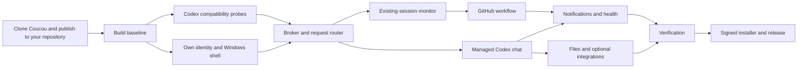

# Anti-Scrolling-Notch — Windows Codex implementation plan

Updated 1 October 2026. This plan replaces the earlier fork-based setup. The audited source and planning baseline have been committed and pushed to your repository; application builds and feature implementation remain pending. Verified initial publication: `47f52e6ce4ea552bda101b0423752b064dbdd5b8` on `main`.

Build from Coucou's existing Windows project. Keep its useful shell and interaction infrastructure, then introduce Codex-specific adapters, reliable session state and GitHub workflow monitoring. This document covers obtaining the project from GitHub, development, complete functional scope, testing, packaging, release and maintenance.

The earlier [repository audit](coucou-analysis.md) defines 124 catalog entries and identifies working features versus placeholders. The [source inventory](coucou-source-inventory.md) lists all 215 audited files. Audited upstream commit: `3cc3333203f60f63326ee949b7b86c7549992a1f`.

## Project decisions

| Item | Starting decision |
|---|---|
| Product name | Anti-Scrolling-Notch. Use own app IDs, artwork and audio before distributing builds. |
| GitHub repository | [YashwanthDevelops/Anti-Scrolling-Notch](https://github.com/YashwanthDevelops/Anti-Scrolling-Notch). Existing independent repository; no GitHub fork required. |
| Development checkout | `C:\Users\Yashwanth\Windows Notch\app`. Import the audited Coucou checkout here and retain its Git history. |
| Reference checkout | Existing `.analysis\coucou`, kept separate from implementation. |
| Git remotes | `origin` = your Anti-Scrolling-Notch repository; `upstream` = Coucou, used only to fetch/review changes. |
| GitHub CLI | Optional. Git handles clone/commit/push; use GitHub's website or an available authenticated API for PRs/releases. `gh` was unavailable during this plan update. |
| Delivery policy | Commit each coherent verified change, push every completed commit, and record actual progress/checks in the project ledger. |
| Agent policy | Agents may work on independent modules; the coordinating agent owns integration, staging, commits and pushes. |
| Initial platform | Windows 11 x64; additional Windows/ARM64 support only after testing. |
| App stack | Tauri 2, Rust, TypeScript/Vite, original Canvas avatar, WebView2. |
| Runtime | Per-user tray app; no Windows service or administrator requirement. |
| Existing Codex sessions | Trusted hook monitoring; supported controls enabled only after compatibility tests. |
| Interactive Ask | Companion-managed Codex App Server sessions using stdio. |
| Existing desktop session control | Experimental adapter only after passive attachment and arbitration are proven. |
| Persistent state | Migrated preferences, bounded SQLite event/history data, OS-protected credentials. |
| GitHub | Read-first PR/review/check monitoring with conditional polling; optional hosted webhooks later. |
| Branding | Own name, app IDs, avatar, icon and sounds; retain upstream MIT attribution. |

The full release includes the island, live Codex monitoring, managed Codex interactions, GitHub workflow tracking, Windows notifications, process/connection health, file/context handling and optional Coucou integrations. Voice, hosted webhook infrastructure and enterprise cloud orchestration are extensions beyond the core release.

## Delivery map

| Stage | Outcome | Depends on |
|---|---|---|
| 1 | Import Coucou into your existing repository and publish this plan | Existing GitHub repository and Git |
| 2 | Reproducible upstream Windows baseline | 1 |
| 3 | Verified Codex/Windows capability contract | 2 |
| 4 | Own product identity and Windows shell | 2, identity decision |
| 5 | Authoritative broker, storage and request routing | 3, 4 |
| 6 | Reliable monitoring of existing Codex sessions | 3, 5 |
| 7 | Useful local Git and GitHub workflow cards | 5, 6 |
| 8 | Interactive companion-managed Codex sessions | 3, 5, 6 |
| 9 | Complete Windows notification and process health behavior | 4–8 |
| 10 | Files, context and remaining integration parity | 5, 8 |
| 11 | Release candidate verified on Windows | 4–10 |
| 12 | Signed installer, updater and public release | 11 |
| 13 | Maintenance and supported-version policy | 12 |

Stages 6–7 produce the first useful monitor. Stages 8–10 complete the interactive product and useful Coucou parity. The project is complete only when Stages 11–12 acceptance criteria pass.



## Stage 1 — Clone Coucou and publish the planning baseline to your repository

Use your existing independent repository. A GitHub fork is optional and adds no requirement here. Clone/import Coucou's Git history into `app`, configure your repository as `origin`, and keep Coucou as the fetch-only `upstream`. All project commits, issues, PRs and releases belong to Anti-Scrolling-Notch.

The README-only `git init` commands supplied by GitHub are for an empty local project. Do not run them inside the Coucou clone: that checkout already has a Git repository, history and README. Change its remotes, then commit your documentation/customizations.

Tasks:

- [x] **SETUP-01** Verify `YashwanthDevelops/Anti-Scrolling-Notch` exists and inspect its remote history. On 1 October 2026 it was empty; no README commit needed to be merged.
- [x] **SETUP-02** Clone the audited Coucou source into the separate `app` directory; keep the analysis checkout intact and preserve source history.
- [x] **SETUP-03** Configure `origin` as Anti-Scrolling-Notch and `upstream` as Coucou. Verify fetch/push URLs; never push to Coucou.
- [x] **SETUP-04** Inspect the checked-out SHA. Compare it with the audited SHA and record any newer upstream changes before relying on this plan's source findings.
- [x] **SETUP-05** Publish the initial source/planning baseline to `main`. Create `work/codex-foundation` when implementation starts; keep unfinished changes on feature branches and use reviewed milestone PRs.
- [x] **SETUP-06** Add the audit, updated plan, source provenance and execution ledger under your project's documentation; retain upstream license and asset-license files.
- [ ] **SETUP-07** Review inherited Actions workflows and release scripts. Replace upstream repository references before enabling your own publishing workflow. Never push release tags to Coucou.
- [x] **SETUP-08** Add the Anti-Scrolling-Notch README and coordinating-agent commit/push rules. Preserve the original Coucou README as reference. Keep build output, local logs, files and secrets ignored.

Reference commands for a fresh setup, before the `app` directory exists. Do not rerun these over an existing checkout. This session can reuse the already-downloaded audited reference as the clone source to preserve the exact analyzed baseline:

```powershell
Set-Location 'C:\Users\Yashwanth\Windows Notch'
git clone 'https://github.com/louis-cfm/coucou.git' 'app'
Set-Location 'C:\Users\Yashwanth\Windows Notch\app'
git remote rename origin upstream
git remote set-url --push upstream DISABLED
git remote add origin 'https://github.com/YashwanthDevelops/Anti-Scrolling-Notch.git'
git remote -v
git rev-parse HEAD
git ls-remote origin
```

After adding/reviewing the plan and project documentation, stage exact intended files, make the planning commit and use an ordinary push:

```powershell
git add README.md AGENTS.md docs
git diff --cached --stat
git commit -m 'docs: establish Anti-Scrolling-Notch implementation plan'
git push -u origin main
```

If the destination gains a README/other commit before that push, fetch and inspect it first. Merge `origin/main` into the imported history with a one-time reviewed `--allow-unrelated-histories` merge, resolve conflicts explicitly and preserve the user's content. Never force-push or reset away destination history. If the clone contains newer source than the audited SHA, compare it before proceeding; the current import should use the audited SHA.

After this initial import, future development can simply clone your repository. If GitHub CLI becomes available, set its default repository to `YashwanthDevelops/Anti-Scrolling-Notch`; otherwise use GitHub web PRs. Imported release scripts/Actions must be inspected before release publication or tags are used.

**Done when:** the audited source history and revised planning documentation are pushed to your repository, remotes/provenance are correct, and build/feature tasks are still explicitly pending.

## Stage 2 — Establish a reproducible Windows baseline

Tasks:

- [ ] **BASE-01** Verify Git, GitHub CLI, Node/npm, Rust/Cargo and Codex availability. Record exact versions in `docs/development-baseline.md`.
- [ ] **BASE-02** Install missing Microsoft C++ build tools with Desktop development with C++, a Windows SDK, Rust MSVC toolchain and WebView2. Use Node 22 initially to match upstream CI; pin the validated toolchain after the first successful build.
- [ ] **BASE-03** Install frontend dependencies using `npm ci` and the checked-in lockfile. Keep dependency upgrades separate from the initial port.
- [ ] **BASE-04** Build/type-check frontend, run the existing Rust tests and record formatting/lint baseline. Existing failures must be identified and fixed or explicitly tracked before unrelated work begins.
- [ ] **BASE-05** Run the native Windows development app locally. Verify tray, hidden/compact/expanded/greeting states, settings, sound, startup toggle and file drop. Do not install Claude hooks or enter service keys merely to inspect the baseline UI.
- [ ] **BASE-06** Build the original installer locally to prove NSIS/toolchain readiness. Treat it as a local baseline artifact, not your distributable app.
- [ ] **BASE-07** Add Windows PR CI for frontend type/build checks and Rust tests. Later require formatting/clippy after recorded upstream issues are resolved.

Commands run from your development checkout's `windows` directory during implementation:

```powershell
Set-Location 'C:\Users\Yashwanth\Windows Notch\app\windows'
node --version
npm --version
rustc --version
cargo --version
codex --version
npm ci
npm run build
cargo test --workspace --locked
cargo fmt --all -- --check
cargo clippy --workspace --all-targets --locked
```

Run these separate interactive commands as needed:

```powershell
npm run tauri dev
```

After closing the development app, verify packaging:

```powershell
npm run pack
```

The original package scripts stage/build the relay as part of frontend build/dev hooks. Preserve that behavior until the new Codex relay wiring is tested. Windows Tauri development requires the C++ tools and WebView2. [Tauri prerequisites](https://v2.tauri.app/start/prerequisites/)

**Done when:** a clean checkout produces a running Windows app and installer, baseline behavior is documented, and Windows CI passes the required baseline checks.

## Stage 3 — Prove Codex compatibility before committing to product controls

Create small integration probes and fixtures, using a disposable test repository/session. This stage decides which controls the app may honestly offer.

Tasks:

- [ ] **COMPAT-01** Record supported Codex CLI/desktop versions and available hook/protocol schemas. Generate types from the installed release rather than assume the latest repository schema matches it.
- [ ] **COMPAT-02** Test trusted observing hooks for session, prompt, tool, compaction, subagent, Stop, Interrupt and SessionEnd events on every supported surface.
- [ ] **COMPAT-03** Verify neutral output for each hook event and a short no-app timeout. Ensure the observer never injects prompt context or blocks normal work.
- [ ] **COMPAT-04** Validate one-time PermissionRequest Allow/Deny, no-decision terminal fallback and malformed/expired response behavior. Do not reuse Claude's `updatedPermissions` contract.
- [ ] **COMPAT-05** Probe managed stdio App Server initialization, auth/model discovery, turn/item streaming, final result, approval, user-input and cancellation.
- [ ] **COMPAT-06** Investigate shared-daemon/existing-desktop attachment as an optional capability. Prove passive observation and multi-client resolution before enabling controls; otherwise leave this adapter disabled.
- [ ] **COMPAT-07** Verify supported navigation destinations. Where exact chat/terminal navigation is unavailable, retain clearly named best-effort Open project/Open Codex actions.
- [ ] **COMPAT-08** Spike native toast activation, mixed-DPI overlay behavior and Explorer-to-WebView2 file drop.
- [ ] **COMPAT-09** Save sanitized event/protocol fixtures and a capabilities matrix in `docs/codex-compatibility.md`.

Deliverable capability matrix:

| Capability | Hooks | Managed sessions | Existing desktop/shared adapter |
|---|---|---|---|
| Lifecycle/activity | Test and enable | Test and enable | Version-gated |
| Streamed assistant/tool output | Unavailable from hooks alone | Test and enable | Version-gated |
| Send/steer/interrupt | No hook-only control | Test and enable | Version-gated |
| One-time permission decision | Test opt-in route | Test typed request | Version-gated |
| Reply to actual question | Terminal fallback | Test typed request | Version-gated |
| Persistent/session grant | No generic Always | Only offered supported scope | Version-gated |

Current hooks and App Server have distinct contracts and trust/lifecycle requirements. Treat their documented coverage as the starting point and installed-version results as the release gate. [Codex hooks](https://developers.openai.com/codex/hooks/), [Codex App Server](https://developers.openai.com/codex/app-server/)

**Done when:** each supported capability has passing evidence and every unsupported capability has a clear UI fallback. Core delivery cannot depend on unproven shared-desktop access.

## Stage 4 — Create your identity and preserve the Windows shell

Tasks:

- [ ] **SHELL-01** Select final name, repository name, app identifier, storage directories, credential namespace and relay name before durable user data is created.
- [ ] **SHELL-02** Replace Coucou/Mochi names, protected character artwork/expressions/animations, icons and sounds with original assets. Keep generic interaction semantics and MIT source attribution.
- [ ] **SHELL-03** Update Cargo/package/Tauri metadata, tray labels, installer names, icon generator, shared-sound paths, autostart registration and diagnostic paths consistently.
- [ ] **SHELL-04** Preserve topmost transparency, nonactivation, click-through, hidden wake strip, compact/expanded states and display positioning. Remove unnecessary broad browser-protection overrides.
- [ ] **SHELL-05** Add fixed-monitor/follow-cursor placement, logical-pixel geometry, edge offset and configurable global shortcut with conflict handling.
- [ ] **SHELL-06** Make Escape, pointer leave, typing, drag and pinned-request behavior consistent. Cosmetic interactions cannot replace an actionable card.
- [ ] **SHELL-07** Preserve greeting, mini avatars, hover feedback, sounds, settings and drop affordance using original visuals; add mute/reduced-motion options.
- [ ] **SHELL-08** Create a larger detail/history window for long output, diff and approval content.

Files affected include `windows/src/island/*`, `src/core/layout.ts`, `src/mochi/*`, `src/core/sound.ts`, styles/settings/views, `src-tauri/src/island.rs`, `tray.rs`, `settings.rs`, configuration/icons and packaging scripts.

**Done when:** your branded shell runs at multiple DPI scales without stealing focus, blocking unrelated desktop areas or displaying protected upstream assets. Coucou's source and asset licenses have different scope. [Asset license](https://github.com/louis-cfm/coucou/blob/3cc3333203f60f63326ee949b7b86c7549992a1f/LICENSE-ASSETS.md)

## Stage 5 — Introduce backend state, persistence and request routing

Implement the reliable foundation before replacing event handlers one by one.

Tasks:

- [ ] **CORE-01** Define versioned Session, Turn, ToolItem, PendingRequest, Repository, Integration and EventEnvelope types.
- [ ] **CORE-02** Build a Rust reducer keyed by source/session/thread/turn/tool/agent IDs. Keep lifecycle, activity, waiting state and connection health separate.
- [ ] **CORE-03** Add snapshot plus monotonic event sequence/replay. UI reload or sequence gaps trigger resynchronization.
- [ ] **CORE-04** Add bounded SQLite history, atomic/migrated preferences and redacted rotating logs. Sensitive content retention is configurable and off by default.
- [ ] **CORE-05** Deduplicate source events; coalesce high-volume text deltas without losing final content/control events. Replace ticker array-index change detection with sequence IDs.
- [ ] **CORE-06** Scope timers to source event/turn generation. A delayed success/badge timer cannot reset newer work.
- [ ] **CORE-07** Build a request router with exact source IDs, bounded concurrency, presentation acknowledgement, deadlines and exactly-once reply semantics.
- [ ] **CORE-08** Clear resolved/expired/cancelled requests, including another client's resolution. Fall back promptly when a hook request cannot be presented.
- [ ] **CORE-09** Harden named-pipe ACL/client identity, size/schema limits, read deadlines and collisions; preserve fast no-app behavior.
- [ ] **CORE-10** Replace frontend authority with a view store consuming backend snapshots/deltas; make bridge errors explicit rather than silently converting failed actions to success-looking null results.

Proposed module layout; create only as each component is implemented:

```text
windows/
  hook/                         Codex observing/permission relay
  src-tauri/src/
    broker/                     reducer, identities, event normalization
    codex/                      capability registry, hook installer, app-server adapter
    requests/                   pending approval/input routing
    github/                     authentication, scheduler, PR/check state
    repositories/               canonical Git/worktree mapping
    notifications/              policy and Windows activation adapter
    processes/                  owned process/transport health
    attachments/                ingest, limits, progress, retention
    storage/                    history, migrations, preferences
    integrations/               typed optional service adapters
  src/
    core/                       generated/shared types, snapshot view store, bridge
    island/                     visibility and priority presentation
    views/                      sessions, PRs, approvals, chat, drop
    detail/                     long output/diff/history
    settings/                   onboarding and configuration
    avatar/                     original procedural rendering
  tests/fixtures/               sanitized protocol/event fixtures
```

**Done when:** tests prove independent sessions, replay after UI reload, safe duplicate/out-of-order handling, bounded queues and no stale decision/timer effects.

## Stage 6 — Replace Claude activity with reliable Codex monitoring

Tasks:

- [ ] **MON-01** Replace Claude-specific relay events, environment assumptions and labels with verified Codex inputs. Preserve tool-use IDs and parent/agent identities.
- [ ] **MON-02** Implement a Codex hook installer with actual diff, backup, exact ownership, stale-preview fingerprint, safe write and owned-entry removal.
- [ ] **MON-03** Add onboarding: detect Codex → preview/install hooks → review/trust in Codex → run a test session → show actual event readiness.
- [ ] **MON-04** Show configured/trusted/connected/last-event states separately; no green dot solely because a file or credential exists.
- [ ] **MON-05** Render a real session selector with overflow, project/model/source labels, independent tickers and child-agent indicators. Optional integration pin count must not limit session monitoring.
- [ ] **MON-06** Map thinking/tool/compaction/approval/completion/interruption states; identify inferred activity and missing hosted-tool coverage.
- [ ] **MON-07** Retain summaries/history; do not call a completed turn a passed build. Open project/chat/terminal actions use verified capabilities.
- [ ] **MON-08** Test multiple sessions, app closed/paused/crashed, UI reload, machine sleep and session end during another session's activity.

**Done when:** two simultaneous Codex sessions and their agents remain independent, observing hooks return promptly, and the island accurately represents known activity without a separate API key.

## Stage 7 — Build local Git and GitHub workflow tracking

Tasks:

- [ ] **GH-01** Resolve canonical repo/worktree/common Git directory, branch, HEAD and remotes through read-only Git operations.
- [ ] **GH-02** Bind session to repo and PR with fork/head-repository/ref/SHA awareness; expose correction for ambiguous remotes or PRs.
- [ ] **GH-03** Support opt-in existing `gh` authentication through structured calls, or a least-privilege credential/account flow. Keep secrets backend-only.
- [ ] **GH-04** Show PR title/state/draft, review requests/decisions, relevant comments/activity and returned links.
- [ ] **GH-05** Show current-head check runs, commit statuses, workflow progress, failed-job links and associated deployments. Distinguish pending/skipped/neutral/cancelled/failed/passed.
- [ ] **GH-06** Implement pagination, conditional caching, serial request scheduling, Retry-After/reset handling, jitter and backoff. First load is a silent baseline.
- [ ] **GH-07** Deduplicate by identity plus status/revision/SHA; capture same-ID transitions and multiple updates between polls.
- [ ] **GH-08** Preserve optional account repository/star statistics with correct pagination, separate from the project workflow card.
- [ ] **GH-09** Add Open PR/job/check/diff, Copy link and debounced Refresh. Mutation actions remain separate later tasks with actual support and visible outcomes.
- [ ] **GH-10** Test forks, branch reuse, multiple worktrees, head changes, old-SHA green checks, private permission errors, offline cache and API rate limits.

Initial proposed refresh policy: roughly 30 seconds during running CI, 60–90 seconds for an active PR, and five minutes idle; obey server hints/limits and refresh after meaningful local changes. A hosted webhook relay is optional later, not required for desktop-only operation.

**Done when:** a test PR's current-head CI/review changes appear correctly, old checks are visibly stale, and restart/polling does not duplicate alerts. [GitHub API guidance](https://docs.github.com/en/rest/using-the-rest-api/best-practices-for-using-the-rest-api)

## Stage 8 — Implement interactive Codex sessions

Tasks:

- [ ] **CHAT-01** Add a managed stdio App Server process and protocol adapter: initialize, lifecycle, stream parsing, request correlation, disconnect and explicit resume.
- [ ] **CHAT-02** Use supported Codex account and model discovery. Keep existing-session monitoring independent of managed-chat authentication.
- [ ] **CHAT-03** Make Ask target explicit: choose an existing companion-managed chat or create a new one in a selected project. Monitoring-only chats show capability limits.
- [ ] **CHAT-04** Stream assistant text and tool output, render markdown/code/citations as supplied, preserve per-chat draft/history and autoscroll behavior.
- [ ] **CHAT-05** Show plan, file changes/diff, command outcome, usage/rate limits where supported in the detail panel.
- [ ] **CHAT-06** Implement send/steer/interrupt for the correct managed turn. Respect Codex policies, configured tools, repository instructions and workspace permissions.
- [ ] **CHAT-07** Render actual command/file/network approval requests with complete target/cwd/reason/scope; offer only available decisions.
- [ ] **CHAT-08** Implement actual user-input questions and MCP elicitation forms/URL flow, with cancellation/expiry/server-resolution handling.
- [ ] **CHAT-09** Route replies exactly once and show delivered/resolved state; never approve from a cosmetic animation or stale toast.
- [ ] **CHAT-10** Replace Anthropic-specific API settings, history/tool encodings and model defaults in the default Codex workflow. Optional additional providers would require separately named modes.

**Done when:** the companion can complete a real managed coding conversation with streamed output, a supported approval/question, interruption and recovery; unsupported existing desktop sessions cannot receive accidental controls.

## Stage 9 — Finish notifications and process/status monitoring

Tasks:

- [ ] **STATUS-01** Centralize notification priority: pending decision/input → actionable failure → active work → recent completion → idle. Preserve GitHub CI as independent state.
- [ ] **STATUS-02** Add island badge/reveal/sound/toast policies, grouping, deduplication, quiet/full-screen rules and per-category settings.
- [ ] **STATUS-03** Implement native Windows notification registration and activation; click opens the right session/PR/detail or explains a stale target.
- [ ] **STATUS-04** Track managed process handles, start time, exit and transport health; do not identify a session solely by a reusable PID.
- [ ] **STATUS-05** Show connected/reconnecting/stale/offline with last-seen evidence. Silence during a long-running tool is not automatically a hang.
- [ ] **STATUS-06** Reconcile pending requests after crash/sleep/disconnect. Never replay an old permission decision or automatically restart a conversation.
- [ ] **STATUS-07** Provide optional low-rate resource display only for tracked processes. Cancellation uses supported turn controls, not broad process termination.
- [ ] **STATUS-08** Add best-effort tracked window focus for sessions launched through the app; test exact terminal navigation before promising it. Mark WSL/remote support separately.

**Done when:** actionable events are visible once, toasts open correct targets, transport/process failures produce truthful recovery state, and quiet users do not receive a toast for every tool call.

## Stage 10 — Complete files, context and optional integration parity

Tasks:

- [ ] **PARITY-01** Implement multiple-file staging with size/type validation, collision-safe naming, quotas, retention, cancellation and per-file status.
- [ ] **PARITY-02** Preserve original drop/mailbox interaction using your avatar, but connect completion to actual copy/preparation. Use Preparing for local work and indeterminate status when progress is unknown.
- [ ] **PARITY-03** Add attachment preview/removal and negotiate actual supported Codex text/image/path inputs. Unsupported formats never silently disappear.
- [ ] **PARITY-04** Add optional explicit Windows window metadata attachment; screenshot capture is a distinct previewable operation with supported image input.
- [ ] **PARITY-05** Preserve n8n execution/details, with functional workflow filtering and correct same-ID status transitions.
- [ ] **PARITY-06** Preserve Vercel lists/details/links, add running states and stable project filters/commit binding.
- [ ] **PARITY-07** Preserve Stripe balance/charges, correct multi-currency totals, minor units and successful-payment semantics.
- [ ] **PARITY-08** Preserve Resend recent emails with pending/delivered/failed distinctions; implement optional explicit sending only with validated settings and actual API outcome.
- [ ] **PARITY-09** Preserve Notion recent accessible-page links and optional project pinning.
- [ ] **PARITY-10** Preserve Cal.com bookings; add a correct timezone/weekday-aware calendar/details if selected for full parity.
- [ ] **PARITY-11** Add Windows compose/share fallback; label Draft opened independently of a verified Sent outcome.
- [ ] **PARITY-12** Move all optional services into the shared typed scheduler, health, filtering and notification framework. Disabled services must stop network activity.
- [ ] **PARITY-13** Remove or implement dormant question/retry/search/result controls. A structured research card is optional; do not ship an action that only looks functional.

**Done when:** the preserved workflows actually work, progress and delivery wording are truthful, optional services are isolated from Codex state, and their absence does not prevent the core app from running.

## Stage 11 — Verify the complete release candidate

Tasks:

- [ ] **QA-01** Add reducer/replay/request-routing tests and versioned Codex protocol fixtures. Retain useful upstream relay/config/file tests.
- [ ] **QA-02** Add native integration checks for no-app fallback, trust/config changes, malformed IPC, concurrent/expired requests, another-client resolution and frontend reload.
- [ ] **QA-03** Test Windows display scales 100/125/150/200%, mixed monitors, hotplug, RDP, fullscreen, click-through, drag/drop and focus restoration.
- [ ] **QA-04** Test keyboard/IME input, Escape, shortcut conflicts, screen-reader names, high contrast, text scaling and reduced motion.
- [ ] **QA-05** Test multiple roots/subagents/tools, prompt after completion, out-of-order duplicates, sleep/restart, old timers and stream final reconstruction.
- [ ] **QA-06** Test GitHub pagination/rate limits/auth expiry/fork SHA mapping and all optional service failures using fixtures plus opt-in real-account validation.
- [ ] **QA-07** Test large/multiple/unsupported files, disk full/access denied, inbox quotas, copy cancellation and cleanup.
- [ ] **QA-08** Measure event latency, CPU/memory/frame activity, network rates and history/log bounds. Confirm no animation/cursor polling while fully hidden; set resource budgets from measured baseline.
- [ ] **QA-09** Validate URL/argument handling, pipe ACL/read limits, backend-only credentials, strict WebView capabilities and redacted diagnostics.
- [ ] **QA-10** Freeze documented supported versions and disabled capabilities, close release blockers, and create a release candidate checklist.

Suggested engineering target: ordinary local event-to-state update under about 250 ms, bounded queues/storage, no network/IPC wait on the render path, no hidden frame loop. These are test targets, not performance claims already achieved.

**Done when:** required automated checks pass and the actual packaged release candidate passes the Windows behavior/failure matrix. Preview screenshots alone are insufficient.

## Stage 12 — Package, sign, publish, update and uninstall

Tasks:

- [ ] **REL-01** Update NSIS resources/version metadata/artifact names and WebView2 prerequisite behavior for your app.
- [ ] **REL-02** Configure Windows code signing and timestamping for installer/app/relay through protected release credentials. Keep signing keys outside source and logs.
- [ ] **REL-03** Add the Tauri updater, its public verification key, signed update artifacts and correctly generated update metadata. Updater signing and Windows executable signing are separate requirements.
- [ ] **REL-04** Implement safe update deferral while decisions are pending, controlled shutdown/reconnect, migration backup and recovery. Verify update signature failures do not install an update.
- [ ] **REL-05** Test fresh per-user install, first launch, startup registration, second instance, upgrade, settings/history migration and recovery from interrupted upgrade.
- [ ] **REL-06** Implement in-app Disconnect/remove-owned-hooks plus optional history/files/credential cleanup. Uninstall must not rewrite unrelated Codex configuration or recursively remove paths outside verified app directories.
- [ ] **REL-07** Test uninstall and a removed/missing relay against supported Codex releases; leave no broken startup task or unexplained active hook entry.
- [ ] **REL-08** Add release CI scoped to your repository with version checks, quality gates, protected signing, installer/artifact generation and checksums.
- [ ] **REL-09** Write README/onboarding, permissions/data explanation, supported capability/version table, troubleshooting and real screenshots/video using your assets. State polling latency and terminal/shared-desktop limitations honestly.
- [ ] **REL-10** Publish a beta to your own GitHub releases, collect opt-in feedback and fix blockers. Publish v1.0 only after release candidate gates pass.

Release contents: signed installer, versioned app/relay, updater payload and signatures/metadata, checksums, release notes, supported-version matrix and installation/troubleshooting guide. A rolling download alias is optional; it is not itself an updater. Tauri verifies signed update artifacts and expects the signature content in update metadata. [Tauri updater guidance](https://v2.tauri.app/plugin/updater/)

**Done when:** a clean machine can install, configure, use, update and uninstall the released product through documented steps, without corrupting Codex configuration or misrepresenting capabilities.

## Stage 13 — Maintain the released product

Tasks:

- [ ] **MAINT-01** Keep issue templates and previewable/redacted diagnostics for version, transport, last event and service errors.
- [ ] **MAINT-02** Test new Codex versions against compatibility fixtures before marking them supported. Unknown versions keep monitoring/control limits explicit.
- [ ] **MAINT-03** Fetch upstream changes and review relevant fixes on a branch. Never blindly merge branding/storage/Claude integration assumptions back into your product.
- [ ] **MAINT-04** Review service API changes, dependency updates, release signing and installer behavior periodically as a maintenance process.
- [ ] **MAINT-05** Preserve schema migrations, history retention and owned-hook compatibility across updates.
- [ ] **MAINT-06** Consider WSL/Linux relay, ARM64, hosted GitHub webhooks, voice or documented desktop control only after their separate tests pass.

**Done when:** there is a documented ownership/support process and users can determine which release supports their Codex/Windows setup. This planning document does not create a scheduled automation.

## Frequent commits, pushes and agent coordination

Your instruction to commit and push frequently applies throughout implementation. Use the following rules:

1. Start by inspecting branch, status and remotes; fetch `origin` before integrating remote work. Preserve unrelated user changes.
2. Implement one coherent behavior or documentation improvement on a short branch such as `work/codex-foundation`, `feature/codex-monitor` or `feature/github-status`.
3. Run checks relevant to the change. Documentation-only changes need consistency/link checks; code needs meaningful build/tests. Do not claim a build passed when it was not run.
4. Update `docs/execution-ledger.md` with task IDs, completed/pending status, changed files, check results and remaining limitations. Record the completed commit hash in the next ledger update or externally verified milestone record; avoid a self-referential commit loop.
5. Stage explicit files, inspect the diff, and make a descriptive commit. Push every completed commit immediately, and push remaining completed commits before ending a work session. Cadence follows useful verified changes, not arbitrary time-based empty commits.
6. Keep a broken/incomplete checkpoint on its feature branch with clear WIP status; do not mark its acceptance gate complete. `main` contains reviewed milestones after the initial unmodified source import.
7. Open PRs against **your** repository. Do not merge/publish a release until required checks and the authorized workflow permit it. GitHub CLI is optional.
8. Verify the remote branch SHA after pushing. If authentication/network/rejection blocks a push, preserve the local commit and report the exact failure; never report it as uploaded.
9. Never force-push protected/shared branches, rewrite unrelated history, upload credentials or accidentally push to `upstream`.

Agent work is permitted by your instruction. Assign independent tasks with clear file/module ownership. Agents report their edits, tests and limitations to the coordinating agent. Only the coordinating agent stages, commits and pushes the shared checkout; use isolated worktrees for genuinely independent branch work and integrate before combined checks. Do not run competing Git mutations from several agents. Agent availability does not replace review or justify creating work without a useful independent subtask.

Recommended PR order:

1. Repository documentation and Windows CI baseline.
2. Identity/assets/window shell changes.
3. Shared model/reducer/replay/storage foundation.
4. Codex relay and reviewed hook installer.
5. Multi-session monitor and history UI.
6. Git/worktree resolver and GitHub scheduler/cards.
7. Managed App Server transport/auth/streaming.
8. Real approval/question routing and detail UI.
9. Windows notifications/process recovery.
10. Attachments/context and separate optional-service fixes.
11. Accessibility/performance/packaging tests.
12. Signed updater/installer and release documentation.

The source/planning import is authorized for this update. Application coding, dependency installation and builds remain subsequent stages. Future publishing targets `YashwanthDevelops/Anti-Scrolling-Notch`; hooks still require configuration review and Codex's trust flow at installation time.

## Execution ledger

Keep the authoritative progress record in `docs/execution-ledger.md` alongside this plan. Each milestone records client date, task IDs, outcome, checks, commit/branch and push evidence. The initial entry must distinguish source/documentation import from successful application build; Stages 2–13 stay pending until their acceptance evidence exists.

The root workspace copy of this plan is a convenience mirror. After import, update the repository copy first and synchronize the root copy, so the published GitHub plan remains authoritative.

## Scope tracking against the Coucou audit

| Audit catalog | Work covered by this plan |
|---|---|
| F01–F28: shell/lifecycle/navigation/settings | Stages 4–6, 9, 11–12 |
| F29–F43: avatar/motion/sounds | Original replacements in Stage 4; accessibility/performance in 11 |
| F44–F66: coding hooks/ticker/approvals | Stages 3, 5–6, 8–9 |
| F67–F72: chat | Stage 8 |
| F73–F89: files/window/mail/search pieces | Stage 10; unsupported/dormant actions removed or explicitly implemented |
| F90: prototype voice | Optional extension, not an existing working parity requirement |
| F91–F112: GitHub and service integrations | Stage 7 plus complete optional modules in 10 |
| F113–F122: platform/delivery/support/assets | Stages 1–2, 4, 11–13; macOS-only distribution is a reference |
| F123–F124: missing updater/notifications/process monitoring | New functionality in Stages 9 and 12 |

## Completion checklist

- [x] Your GitHub repository is the development/publication origin; inherited release scripts must have their destination and branding adapted before product releases.
- [ ] A clean checkout builds and tests reproducibly.
- [ ] Own identity/assets are used; MIT attribution is retained.
- [ ] The Windows island, tray, settings, startup, hotkey and detail panel work.
- [ ] Multiple Codex sessions/subagents remain independent and survive UI reloads.
- [ ] Supported hook/managed-session capabilities are verified and clearly separated.
- [ ] Approvals/questions route to the exact request, resolve once and expire safely.
- [ ] GitHub PR/CI/review information corresponds to the correct repository and SHA.
- [ ] Notifications and process/transport health are truthful, quiet and recoverable.
- [ ] File readiness, context sending and optional service actions are functional and accurately labeled.
- [ ] Keyboard/accessibility/reduced-motion/performance checks pass.
- [ ] Signed installation, update, migration and uninstall are tested on a clean machine.
- [ ] Public documentation and release notes match the shipped capability matrix.
- [ ] A beta is validated, release blockers are closed and the v1.0 installer is published.

Complete the source/planning import in Stage 1, then begin **BASE-01 through BASE-07** and the Codex compatibility gate. Establish the source, build baseline and adapter contracts before changing each subsystem. All implementation commits and pushes belong to your Anti-Scrolling-Notch repository.
